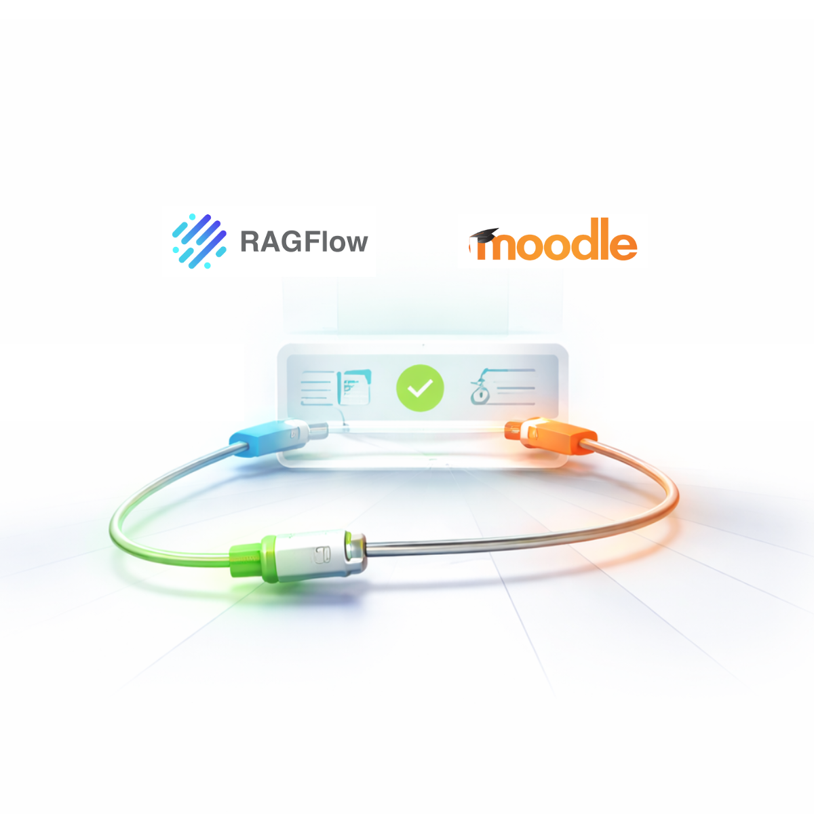

  

  

    <h1>RAGcon Documentation</h1>
    
Guides &amp; reference for the RAGcon products.

  

## Not sure where to start?

Answer one question:

- Bring your Moodle / course content into an AI-powered RAG and keep it in sync? → **[RAGflow Moodle Connector](ragflow-moodle-connector/index.md)**
- Let Moodle reach RAGflow through its AI subsystem? → **[RAGflow AI provider](moodle-ragflow/plugins/provider.md)**
- Want an AI tutor in each course? → **[Tutor block](moodle-ragflow/plugins/tutor.md)**
- Need central AI help across your Moodle site? → **[Helpdesk](moodle-ragflow/plugins/helpdesk.md)**
- Want usage metrics for the RAGflow AI plugins? → **[Usage dashboard](moodle-ragflow/plugins/dashboard.md)** (paid)

The base is always the **RAGflow AI provider** (backend) — install it first.

## Products

### Moodle RAGflow Suite

A set of Moodle plugins that bring [RAGflow](https://ragflow.io)-powered retrieval-augmented
generation (RAG) into Moodle — a course tutor, a knowledge-base search block, a site-wide help
drawer, and a usage dashboard, all driven by a shared AI provider.

→ **[Get started with the Moodle RAGflow Suite](moodle-ragflow/index.md)**

### RAGflow Moodle Connector

A built-in RAGflow data source that syncs a Moodle site's content into a RAGflow knowledge base, so it can
be searched, cited and answered over — and kept current automatically.

→ **[Read the RAGflow Moodle Connector docs](ragflow-moodle-connector/index.md)**

---

More RAGcon products will be documented here over time. Each product lives in its own section;
this site is built from Markdown and published automatically via GitHub Actions.

## Licences and attributions

!!! info "The software these products build on"
    **Moodle** is software by **Moodle Pty Ltd**, released under the **GNU GPL v3 or later**.

    - Source: <https://github.com/moodle/moodle>
    - Bug tracker: <https://moodle.atlassian.net/jira/projects>

    *The word Moodle and associated Moodle logos are trademarks or registered trademarks of
    Moodle Pty Ltd or its related affiliates.*

    ---

    **RAGflow** is open-source software by **InfiniFlow Inc.**, released under the **Apache License 2.0**.

    - Web: <https://ragflow.io>
    - Source: <https://github.com/infiniflow/ragflow>
    - Bug tracker: <https://github.com/infiniflow/ragflow/issues>

    These products are independent integrations; they are not affiliated with or endorsed by
    Moodle Pty Ltd or InfiniFlow Inc.
