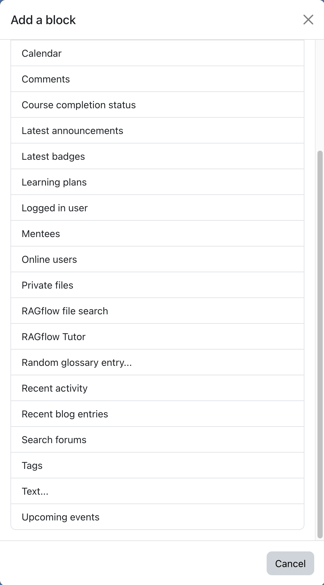

# User guide — for trainers

This guide is for **teachers / trainers** who add and run a RAGflow Tutor in their courses. Setup of
RAGflow itself and site-wide options are handled by an [administrator](admin.md); learners have their
own [student guide](student.md).

## What you can do

- Add a **RAGflow Tutor** to your course — a chat that answers from your course documents.
- Build and manage the tutor's **knowledge base** (upload, re-process, delete, download files).
- Set the **greeting** and **system instruction** to shape how the tutor responds.
- Add a **RAGflow file search** box for document look-up.

Exactly which of these you can do depends on the capabilities your administrator granted (typical
defaults: teachers can use, add and manage files; managers can also create/change the knowledge base).

## Add the Tutor block

<!-- shot:trainer-01 -->

*Turn editing on, then Add a block → RAGflow Tutor.*

1. In your course, turn **editing on**.
2. **Add a block → RAGflow Tutor**.
3. Open the block's **Configure** screen. **Selecting or creating the knowledge base / assistant is a
   manager / site-administrator task by default** — if your role has it, you'll see the field:
    - pick an existing one, or
    - choose **➕ Create new knowledge base…** and give it a name — the block creates a fresh RAGflow
      knowledge base for this course. Leave **Manage files from this block** ticked (the default) to
      upload and manage its documents from the in-block panel; untick it to only connect Moodle to the
      new knowledge base and manage the documents in RAGflow itself. This choice is fixed once the block
      is created.

    If you don't see this field, the block shows a hint to **ask a site administrator** to choose a
    knowledge base. Once they have, come back and add your documents below.
4. Optionally set a **greeting**, a **system instruction** (tone, rules, "answer only from the course
   materials", etc.) and whether to **show sources** with answers (*Include sources*).

## Build the knowledge base

For a **This block instance** (Moodle-managed) knowledge base, the block shows a **knowledge-base panel**
with a status light and a file area:

- **Add file** — upload one or more documents. They are virus-scanned and sent to RAGflow, then parsed.
- **Status lights:** green = ready, yellow = still linking or a file is still parsing, red = a problem.
  Hover for details. The panel refreshes itself while things are processing.
- **Re-process** a file if you changed it or a parse failed; **delete** a file you no longer want;
  **download** a file (a secure, short-lived link).

!!! warning "Where your files live"
    Uploaded documents are stored **in RAGflow, not in Moodle**, and are visible/manageable by all
    trainers and admins of the course. Only upload material you may share with the tutor.

!!! tip "Wait for parsing"
    The tutor can only answer from documents that have finished parsing (green). Give large uploads a
    little time before testing.

## Add a Search block (optional)

**Add a block → RAGflow file search** puts a search box on the page. Note that **choosing the knowledge
base** for a search block is reserved to site administrators — ask your admin to point it at the right
dataset.

## FAQ

**The tutor says "Unexpected response from RAGflow" — what do I do?**
Usually the RAGflow service is briefly unavailable; try again shortly. If it persists, contact your
administrator. If you hold the right permission, expand **Details** under the error to see the technical
cause (e.g. `HTTP 502`).

**The tutor doesn't know something that's in my documents.**
Check the knowledge-base panel: is the file green (parsed)? A yellow/red file isn't searchable yet.
Re-process it if needed, and make sure the document actually contains the answer.

**Can I limit the tutor to just my course's materials?**
Yes — a *This block instance* knowledge base (the default for a block-created KB) answers only from the
files you upload to that block.

**Who can see and manage the uploaded files?**
All trainers and admins of the course. Students only chat with the tutor; they don't see the file panel.

**Can I change the assistant/knowledge base later?**
If you have the *change knowledge base* capability (often Manager), yes, via the block's Configure
screen. Otherwise ask your administrator.

**How do I change the tutor's tone or rules?**
Edit the **system instruction** in the block configuration (requires the *edit content* capability).
The greeting is the first message learners see.

**Is there a size limit for uploads?**
Yes — set by your administrator (default 50 MB per file), capped by Moodle's own upload limit.
