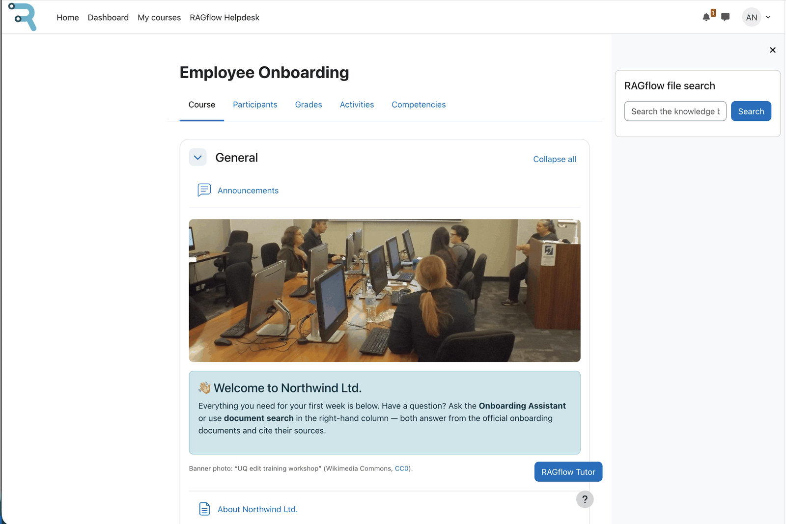

  

  

    <h1>Moodle RAGflow Suite</h1>
    
Grounded AI — tutor, search and help desk.

  

The Moodle RAGflow Suite connects Moodle to a [RAGflow](https://ragflow.io) instance so teachers and
students can ask questions and get answers based on your own documents (retrieval-augmented
generation). Everything runs **inside Moodle** — there is no separate portal and no extra sign-up. An
administrator connects the suite to RAGflow **once, centrally**; after that, trainers and students
simply use it.

It is built on Moodle's **AI subsystem**: a single AI provider connects to RAGflow, and several blocks
and placements use it. Because you run RAGflow yourself, your data — and the choice of AI models — stay
under your control, and every answer is grounded in your own content and cites its **sources**. RAGflow
even reads scanned pages, images and tables, not just plain text — see
[Document understanding](document-understanding.md).

<!-- shot:hero-01 -->

*The RAGflow suite in a course: Tutor block and Search block side by side.*

## What's in the suite

| Plugin | Type | What it does |
|---|---|---|
| **[AI provider (RAGflow)](plugins/provider.md)** | `aiprovider_ragflow` | The backend. Configured as an AI-provider instance; provides chat, search, sources and (optional) conversation and long-term memory using RAGflow. **Every other plugin depends on it; it has no dependencies of its own.** |
| **[Tutor block](plugins/tutor.md)** | `block_ragflowtutor` | A per-course tutor chat with its own knowledge base (upload course documents, ask questions). |
| **[Search block](plugins/search.md)** | `block_ragflowsearch` | A knowledge-base search box that returns ranked source documents. |
| **[Helpdesk placement](plugins/helpdesk.md)** | `aiplacement_ragflowhelpdesk` | A site-wide help chat, reached from the site's *More* menu. It answers from a central knowledge base. |
| **[Usage dashboard](plugins/dashboard.md)** | `local_ragflowdashboard` | Admin KPIs, charts and logs of usage and failures (metrics only; optional debug capture). **An optional premium add-on; the other plugins work fully without it.** |

## Requirements

- **Moodle 5.0, 5.1 or 5.2** (PHP 8.1–8.3; PostgreSQL or MariaDB/MySQL) — see
  [Moodle version specifics](moodle-version-notes.md).
- A reachable **RAGflow instance, version 0.25 or later**, and an **API key** (self-hosted or hosted).
  The suite is a client for RAGflow. It does not bundle or run RAGflow itself. RAGflow 0.25 added the
  native Memory API used by the optional long-term memory, so it is the supported baseline. The core
  retrieval and chat features also work on earlier versions.
- Ability to install plugins (site administrator).

## Install order (important)

The provider is a dependency of every other plugin, so install it **first**:

1. `aiprovider_ragflow` (the provider)
2. `aiplacement_ragflowhelpdesk`, `block_ragflowtutor`, `block_ragflowsearch` (in any order)
3. `local_ragflowdashboard` (optional; consumes the provider's usage events)

## Next steps

1. **[Set up RAGflow](setup-ragflow.md)** — connect Moodle to your RAGflow instance and create a
   knowledge base + assistant.
2. Enable the plugins you want (tutor, search, helpdesk, dashboard).
3. See the user guides for day-to-day use — for
   **[administrators](guides/admin.md)**, **[trainers](guides/trainer.md)** and
   **[students](guides/student.md)**.

## Development

!!! info "Developed by RAGcon GmbH"
    The Moodle RAGflow Suite is developed with the help of a range of **AI tools**, under the professional
    **supervision of the RAGcon GmbH team** — pairing fast, AI-assisted development with human review,
    automated testing and security checks before every release.

## Built on Moodle and RAGflow

!!! info "The software this suite builds on"
    **Moodle** is software by **Moodle Pty Ltd**, released under the **GNU GPL v3 or later**.

    - Source: <https://github.com/moodle/moodle>
    - Bug tracker: <https://moodle.atlassian.net/jira/projects>

    *The word Moodle and associated Moodle logos are trademarks or registered trademarks of
    Moodle Pty Ltd or its related affiliates.*

    ---

    **RAGflow** is open-source software by **InfiniFlow Inc.**, released under the **Apache License 2.0**.

    - Web: <https://ragflow.io>
    - Source: <https://github.com/infiniflow/ragflow>
    - Bug tracker: <https://github.com/infiniflow/ragflow/issues>

    This suite is an independent integration; it is not affiliated with or endorsed by Moodle Pty Ltd
    or InfiniFlow Inc.
