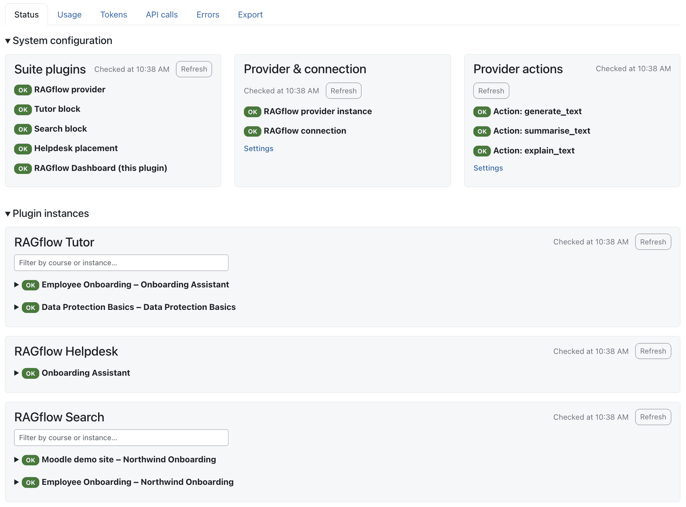
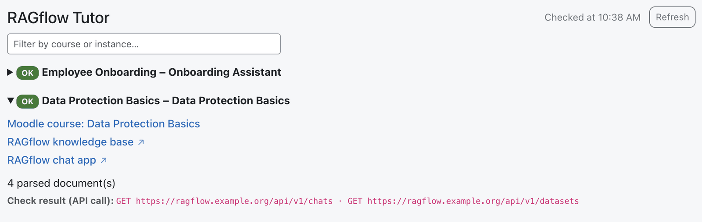
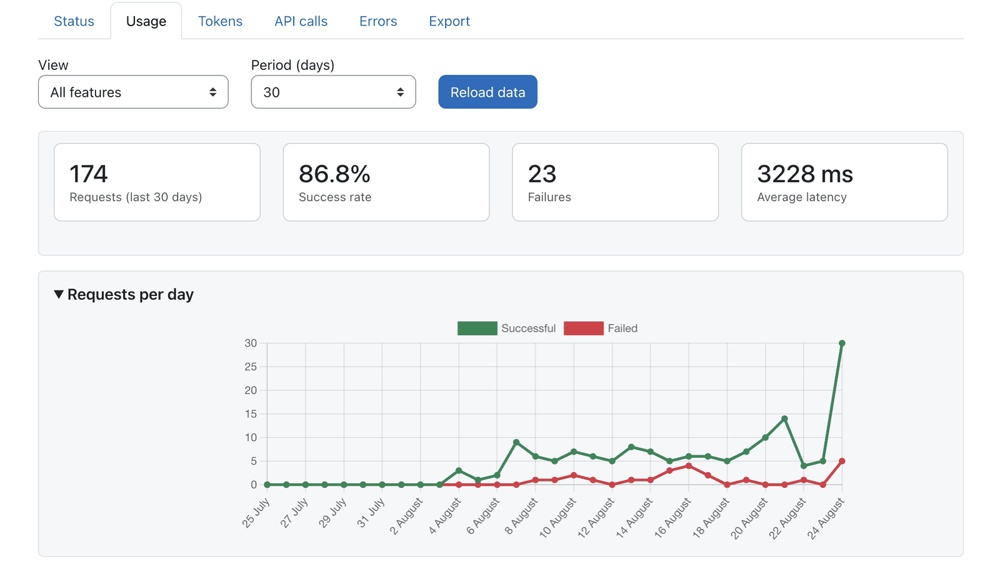
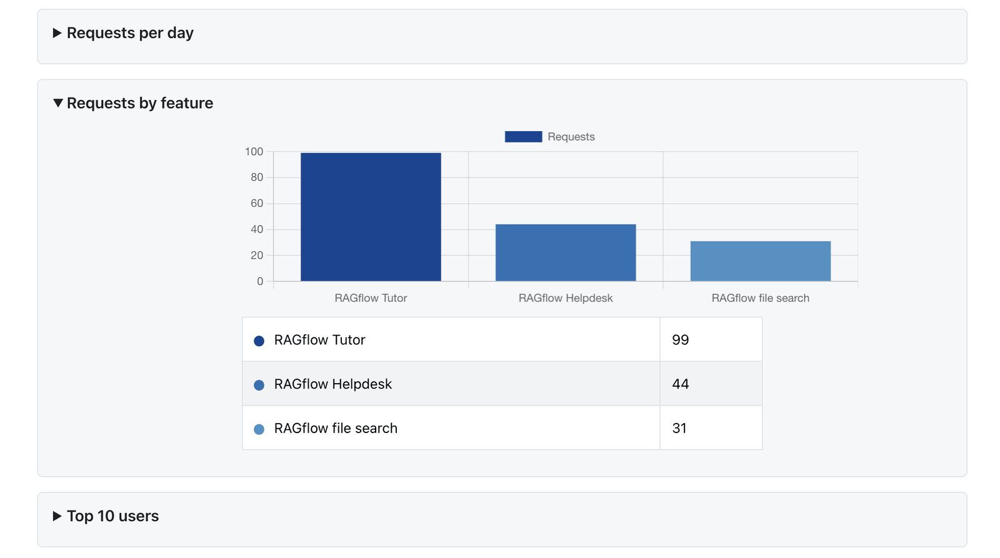
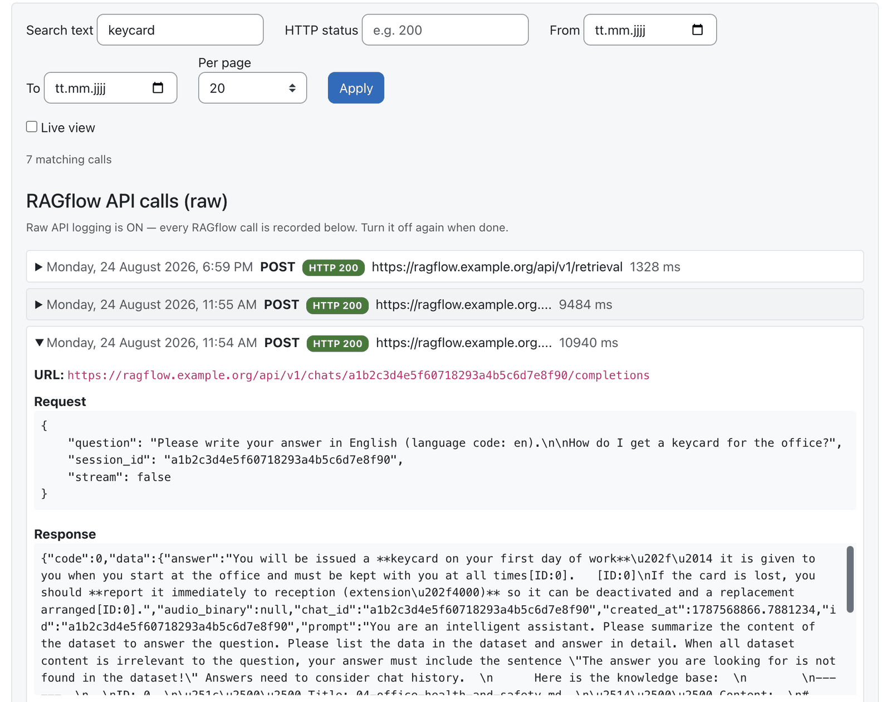
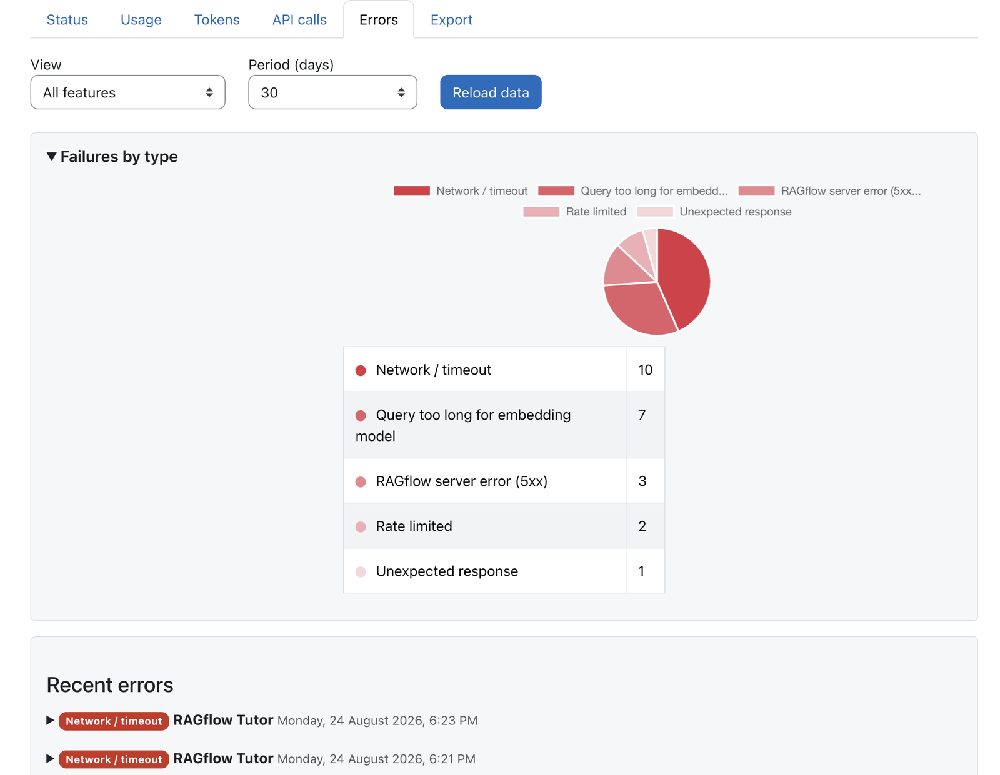
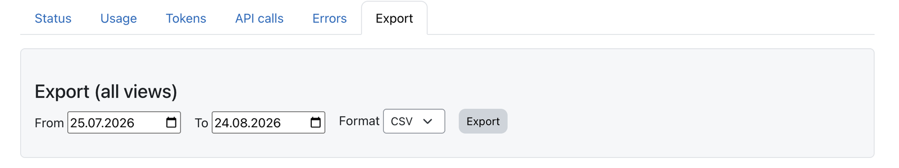
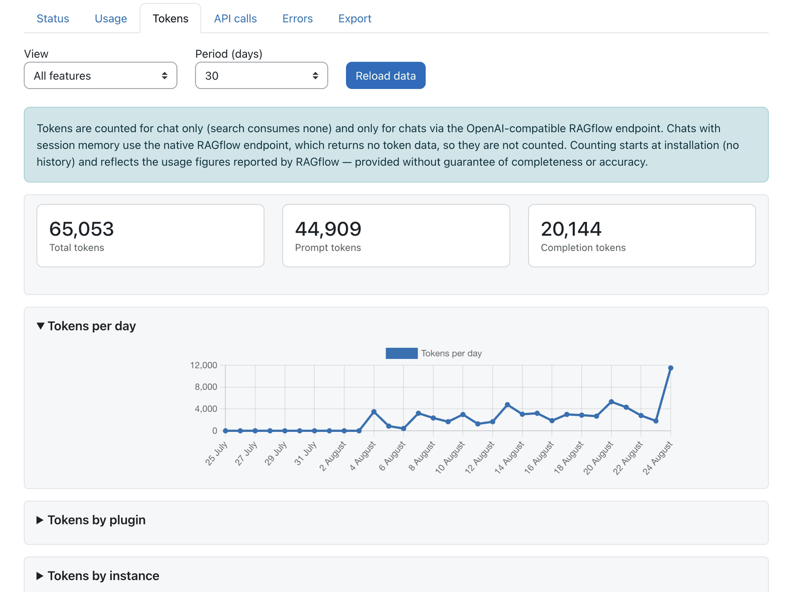
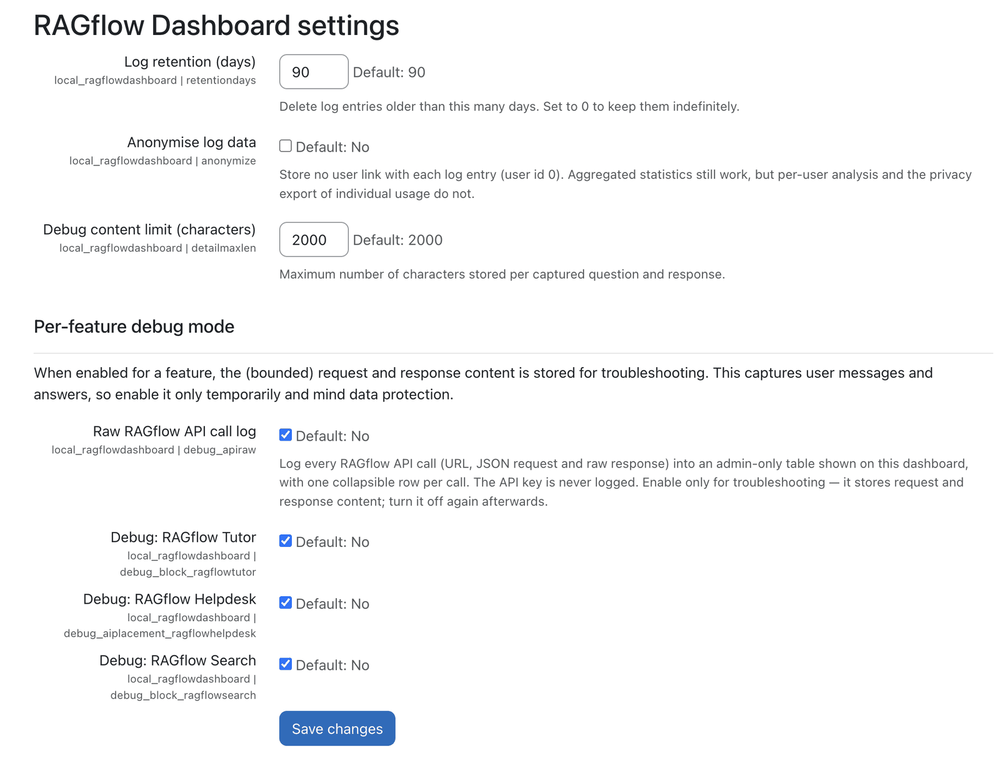

  

  

    <h1>RAGflow Dashboard</h1>
    
See if the AI works, how it's used, what it costs.

  

!!! info "Paid plugin — available on the Moodle Marketplace"
    The Usage Dashboard is the RAGflow suite's one **commercial** plugin. Unlike the free, open-source
    Tutor / Search / Helpdesk plugins and the AI provider, it is a **paid add-on distributed through the
    Moodle Marketplace** — so there is no public source repository for it.

    - **Why it pays off (the business case):** [Usage dashboard — value at scale](dashboard-value.md)
    - **Moodle Marketplace listing:** *link to follow*
    - **Public issue tracker:** [https://github.com/ragcon-ai/moodle-local_ragflowdashboard/issues](https://github.com/ragcon-ai/moodle-local_ragflowdashboard/issues){ target="_blank" rel="noopener" }

    It remains **GPLv3**: buyers receive the complete source with their purchase. The paywall gates
    access, updates and support — not the code.

**Component:** `local_ragflowdashboard` 
**Requires:** Moodle 5.0–5.2 
**Depends on:** `aiprovider_ragflow` 
**Licence:** paid (Moodle Marketplace)

An admin-only, **tabbed** report that shows **how the suite is used**: status and health, request
volume, **token consumption**, raw API calls and error breakdowns, plus an optional per-feature **debug
capture** for diagnosis. It is the suite's **paid add-on** (see above): the free Tutor, Search, Helpdesk
and provider plugins run without it. It records the provider's usage separately, so it is entirely
optional and does no harm if it is not installed. It also ships `rfdsource_*` sub-plugins that give each
feature its own status checks and analytics.

## Features

<!-- shot:dashboard-01 -->

*The Status tab: System configuration and the per-instance plugin section, each with its own health.*

<!-- shot:dashboard-09 -->

*An opened instance links to its Moodle course and to the RAGflow knowledge base and chat app.*

<!-- shot:dashboard-02 -->

*KPI cards and requests per day, split into successful and failed.*

<!-- shot:dashboard-03 -->

*Requests by feature, top users, user group and course.*

<!-- shot:dashboard-05 -->

*The raw API-call log with filters — the API key is never logged.*

<!-- shot:dashboard-06 -->

*Failures grouped by labelled error type, with a recent-errors list.*

<!-- shot:dashboard-08 -->

*Export the usage log (metrics only) for a date range.*

The report opens at *Site administration → Reports → RAGflow Dashboard* and is organised into **tabs**. A
**view** selector (All features + one per installed source) and a **period** selector (today / 2 / 3 / 7 /
14 / 30 / 90 days, default **today**) filter the analytics tabs; controls reload over AJAX. Charts use
Moodle's built-in Chart API with a consistent palette (green = success, red = errors, blue for neutral
counts) and a colour-coded data table (a swatch per row) under each categorical chart.

- **Status:** is the provider configured and reachable, and is each configured reference correctly
  linked? Organised into two collapsible sections:
    - **System configuration** — three boxes side by side (stacked on narrow screens): **Suite plugins**
      (which of the five are installed — shown even when RAGflow is unreachable, no API call needed),
      **Provider & connection** (is the provider configured, and does a probe reach RAGflow?) and
      **Provider actions** (for each configured core_ai action — generate / summarise / explain text — the
      health of the assistant it uses). These are plain checks: a message appears only when something is
      not OK, and a single **Settings** link leads to the relevant admin page — no API-call proof line
      here.
    - **Plugin instances** — one entry per **Tutor / Search / Helpdesk** instance, titled *"Course –
      instance"* (the RAGflow assistant or knowledge-base name; no link in the title). Opening an entry
      reveals a link to the **Moodle course** plus clearly-marked links to the **RAGflow knowledge base**
      and **RAGflow chat app** (these open RAGflow in a new window), the parse status (e.g. *4 parsed
      documents*), and — for privileged viewers — the concrete **API call** used as proof. Tutor and
      Search add an instant, client-side **filter** over course and instance name.
  Every reference verdict comes from **one shared check** and is shown as a traffic light with five
  states: **OK** (green), **degraded** (amber — usable but e.g. the knowledge base has no documents yet or
  is not parsed), **missing** (red — the assistant/knowledge base was deleted in RAGflow), **could not be
  verified** (amber — RAGflow was unreachable, so this is a connection problem, *not* a configuration
  fault) and **not configured** (a **blue notice** — nothing set up yet). *Missing* and *could not be
  verified* are never conflated; red is reserved for genuine faults. A per-area **Refresh** re-runs just
  that box and refreshes the shared result for the other areas too.
- **Usage:** KPI cards (Requests, Success rate, Failures, Average latency), requests per day (successful
  vs failed), requests by feature, **Top 10 users**, requests **by user group** (trainers vs.
  students/users) and **by course**. Sections are collapsible: one open at a time, remembered across
  view/period changes.
- **Tokens:** chat **token consumption** (prompt / completion / total) as KPIs, per day, **by plugin** and
  **by provider instance**. See *What is counted* below.
- **API calls:** the raw RAGflow API-call log (one collapsible row per call) with a per-page selector
  (10 / 20 / 50), **paging**, a **live** auto-reload and **filters** (HTTP status, free text, date range).
  Off unless the raw-API-log toggle is on; the **API key is never logged**.
- **Errors:** **failures by error type** (labelled, e.g. *RAGflow server error (5xx)*, *Query too long for
  embedding model*, *Rate limited*) and a collapsible **recent-errors** list.
- **Export:** download the usage log (metrics only) for a date range as **CSV** (default), **XML** or
  **PDF**. The export covers **all views** in one file: rows are labelled with the view (source) that owns
  them and grouped by view — a *View* column in CSV/XML, one section per view in the PDF (with a KPI
  summary). The acting user resolves to a name, or a dash when anonymisation is on.

Other: a **usage log — metrics only** (no message content, safe for the standard log store); an optional
**per-feature debug capture** (bounded request/response, admin-only, only while enabled); a daily
**retention/purge** task; and an **anonymisation** option (rows without a user link, aggregate stats still
work).

## What is counted (tokens)

<!-- shot:dashboard-04 -->

*Token consumption per day, by plugin and by provider instance.*

!!! note "Token accounting — scope and no guarantee"
    Tokens are counted **for chat only** (search consumes none) and only for chats that use RAGflow's
    **OpenAI-compatible** endpoint. Chats with **session memory** use RAGflow's native endpoint, which
    **returns no token data**, so those turns are **not** counted. Counting **starts at installation**
    (there is no history), and the figures reflect what RAGflow reports — **provided without guarantee of
    completeness or accuracy**.

## Configuration

### Admin settings — *Site administration → Plugins → Local plugins → RAGflow Dashboard settings*

<!-- shot:dashboard-07 -->

*Retention, anonymisation and the per-feature debug toggles.*

| Setting | Type | Default | Meaning |
|---|---|---|---|
| **Log retention (days)** (`retentiondays`) | integer | `90` | Delete log entries older than this many days. `0` = keep indefinitely. |
| **Anonymise log data** (`anonymize`) | checkbox | off | Store no user link (user id 0). Aggregate stats still work; per-user analysis / privacy export do not. |
| **Debug content limit (characters)** (`detailmaxlen`) | integer | `2000` | Max characters stored per captured question and response. |
| **Per-feature debug mode** (heading) | — | — | When enabled for a feature, the (bounded) request/response content is stored for troubleshooting — this captures user messages and answers, so enable only temporarily and mind data protection. |
| **Debug: {feature}** (`debug_<component>`) | checkbox | off | One toggle **per feature** owned by an installed source (Tutor / Helpdesk / Search, and any future `rfdsource_*`). When on, that feature's request/response content is captured. |
| **Raw RAGflow API call log** (`debug_apiraw`) | checkbox | off | Log every RAGflow API call (URL, request, response, status, duration) — this powers the **API calls** tab. The API key is never stored. Verbose; enable only for diagnosis. |

## Capabilities

| Capability | Default roles | Purpose |
|---|---|---|
| `local/ragflowdashboard:view` | Manager (admin report) | View the dashboard, logs, debug captures and export. Intentionally **not** granted to teaching roles, since the data reveals usage patterns. |

## Roles & permissions (who can do what)

| Role | What this role can do |
|---|---|
| **Site administrator · Manager** | **View** the dashboard: KPIs, charts, logs, debug captures and export (`:view`). |
| **Teacher (editing & non-editing) · Student** | **No access** by default: the usage data reveals usage patterns, so it is intentionally not granted to any teaching or learning role. |
| **Guest / not logged in** | No access. |

Grant `local/ragflowdashboard:view` to another role only if you deliberately want it to see site-wide
usage data.

## Data model

- **`local_ragflowdashboard_log`:** one row per request, **metrics only**: time, component, action, user
  id, course id, context id, success, error type, latency (ms), item count, the **provider instance id**
  and the chat **token counts** (prompt / completion / total). Never stores message content.
- **`local_ragflowdashboard_debug`:** request/response **content** (question + response), written
  **only** while a feature's debug toggle is on, truncated to the debug content limit. Written directly, so
  content never reaches the standard log store.
- **`local_ragflowdashboard_apilog`:** the raw RAGflow API-call log (URL, JSON request, raw response,
  status, duration), written **only** while the raw-API-log toggle is on. The **API key is never stored**.

## Sub-plugins (`rfdsource_*`)

Each RAGflow feature contributes a dashboard section as a sub-plugin, shipped **inside** the dashboard
package: **RAGflow Tutor** (`rfdsource_tutor`), **RAGflow Helpdesk** (`rfdsource_helpdesk`), **RAGflow
Search** (`rfdsource_search`). Installing another `rfdsource_*` adds its section and debug toggle
automatically.

## Availability, licensing &amp; support

The Usage Dashboard is a **paid plugin** — the only commercial component of the RAGflow suite (the Tutor,
Search and Helpdesk plugins and the AI provider are free and open-source).

- **Where to get it:** the **Moodle Marketplace** — *listing link to follow*. Buy it there, then install the
  plugin ZIP like any other Moodle plugin.
- **Licence:** **GPLv3**. The purchase includes the complete source code; the fee covers access, updates and
  support, not the code itself.
- **Support &amp; bug reports:** the **[public issue tracker](https://github.com/ragcon-ai/moodle-local_ragflowdashboard/issues)**.

## Privacy

The dashboard stores usage metrics and (only while debug is enabled) bounded request/response content,
with full privacy export/deletion support. With **anonymise** on, rows carry no user link. Retention
purges old rows automatically.
