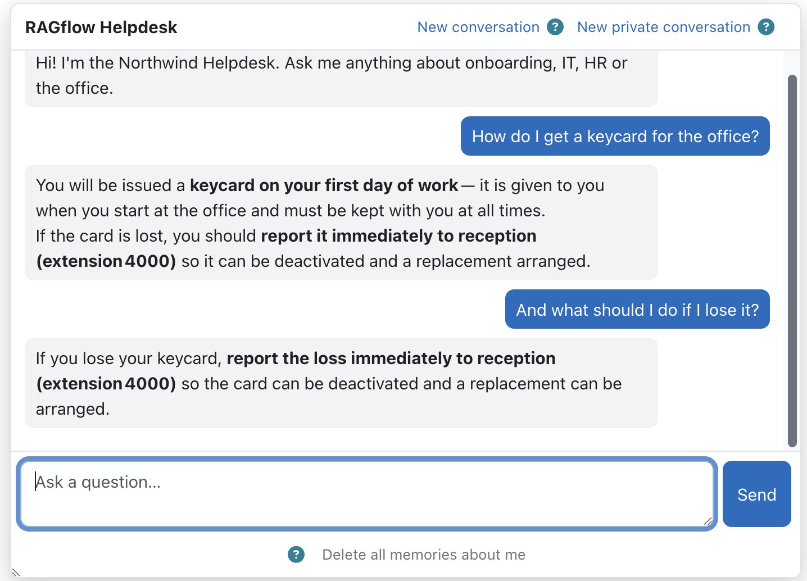
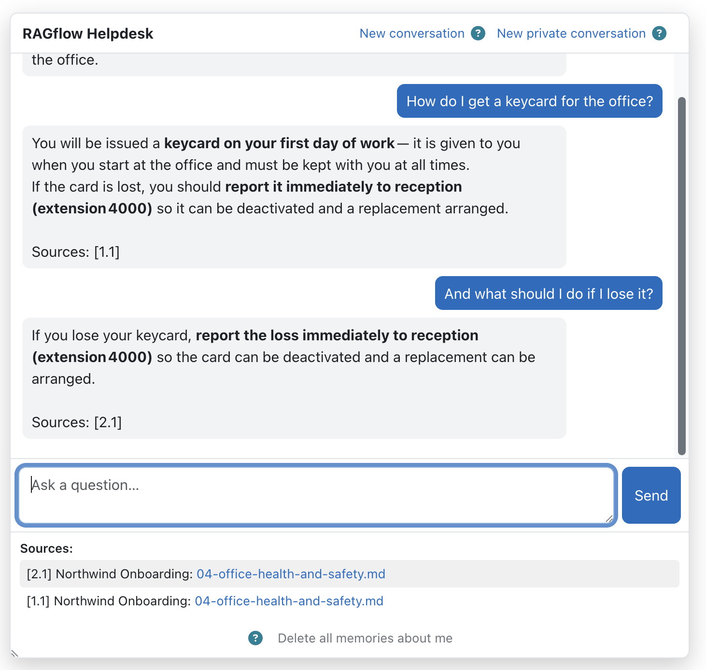
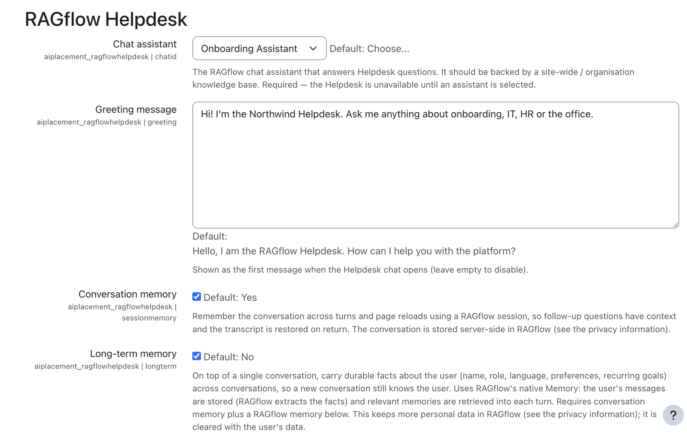

  

  

    <h1>RAGflow Helpdesk</h1>
    
A site-wide help desk from your own docs.

  

!!! info "Repository &amp; issue tracker"
    - **Repository:** [https://github.com/ragcon-ai/moodle-aiplacement_ragflowhelpdesk](https://github.com/ragcon-ai/moodle-aiplacement_ragflowhelpdesk){ target="_blank" rel="noopener" }
    - **Issues / bug tracker:** [https://github.com/ragcon-ai/moodle-aiplacement_ragflowhelpdesk/issues](https://github.com/ragcon-ai/moodle-aiplacement_ragflowhelpdesk/issues){ target="_blank" rel="noopener" }

**Component:** `aiplacement_ragflowhelpdesk` 
**Requires:** Moodle 5.0–5.2 
**Depends on:** `aiprovider_ragflow`

!!! tip "Deep document understanding"
    Answers draw on the **content** of your documents — scanned pages, images and tables included, read
    by OCR, layout and vision models. See [Document understanding](../document-understanding.md).

A site-wide **help drawer** (an AI *placement*). It adds a **RAGflow Helpdesk** item to the site's
primary (More) menu. The item opens a chat page that answers from an organisation-wide RAGflow knowledge
base (system context, no course scope), typically your help, FAQ or support content. It has its own
settings and uses the shared chat engine from the [AI provider](provider.md).

<!-- shot:helpdesk-02 -->

*The help drawer answers from your organisation-wide knowledge base.*

!!! abstract "Easy setup"
    1. [Install the RAGflow AI provider first](provider.md)
    2. Enable the Helpdesk placement
    3. [Choose the help assistant](#configuration)
    4. Set greeting and memory

## Features

<!-- shot:helpdesk-01 -->

*The placement adds a RAGflow Helpdesk entry to the site's primary menu.*

<!-- shot:helpdesk-03 -->

*Follow-up questions keep context; the transcript is restored on return.*

<!-- shot:helpdesk-04 -->

*Users can start a new conversation, forget memory or chat privately.*

- **Site-wide navigation entry → chat page** at the system context, shown only when the user is logged
  in (not a guest), has the *use* capability, and the placement is enabled and configured.
- **Conversation (session) memory** (on by default): follow-ups keep context and the transcript is
  restored on return (stored server-side in RAGflow).
- **Long-term memory** (optional): carries durable facts about the user (name, role, language,
  preferences, recurring goals) across conversations, using RAGflow's native Memory.
- **Configurable greeting**, optional **source citations**, and answers in the user's Moodle language.
- **Private/incognito mode** and drawer controls: **New conversation**, **New private conversation** and
  **Delete all memories about me** (from the shared engine).

## Use cases

Three ways teams use the Helpdesk — expand an example. Pair any of them with the
[RAGflow Moodle Connector](../../ragflow-moodle-connector/index.md) to keep the organisation-wide help
knowledge base aligned with the policy and FAQ documents maintained in Moodle.

??? example "Enterprise — internal IT &amp; HR help desk"
    Staff hit the same questions every week — VPN resets, the expense policy, holiday requests. The
    Helpdesk answers them site-wide from the company's IT and HR documentation, remembers the conversation
    for follow-ups, and offers a private mode for sensitive questions.

    When the docs don't cover something
    it says so, instead of inventing a confident answer that costs more support time than none.

??? example "Universities — student services"
    A university exposes a site-wide help drawer that answers enrolment, certificate, exam-regulation and
    IT questions from the official student handbook and IT guides.

    It sits on every page, is available to
    logged-in users, and answers in the user's language — taking routine load off the service desk during
    enrolment and exam peaks.

??? example "Public sector — staff support with data control"
    An authority runs an internal help desk for procedures, forms and internal policies.

    Answers are
    grounded and cited, long-term memory is opt-in and user-clearable, the log stores metrics only, and
    everything runs on an instance under the authority's control — the controls a data-protection officer needs to sign it off.

## Configuration

### Admin settings — *Site administration → Plugins → AI placements → RAGflow Helpdesk*

<!-- shot:helpdesk-05 -->

*Placement settings: assistant, greeting, memory and citations.*

| Setting | Type | Default | Meaning |
|---|---|---|---|
| **Chat assistant** (`chatid`) | select (live) | — (required) | The RAGflow assistant that answers Helpdesk questions; should be backed by a site-wide knowledge base. **The Helpdesk is unavailable until an assistant is chosen.** |
| **Greeting message** (`greeting`) | textarea | "Hello, I am the RAGflow Helpdesk…" | First message shown when the drawer opens; empty to disable. |
| **Conversation memory** (`sessionmemory`) | checkbox | **on** | Remember the conversation across turns and reloads (RAGflow session). |
| **Long-term memory** (`longterm`) | checkbox | off | Carry durable user facts across conversations. Requires conversation memory **and** a RAGflow memory (below). |
| **RAGflow memory** (`memoryid`) | select (live) | — | The RAGflow memory used for long-term memory (create a **RAW** memory in RAGflow — the only supported type). One shared memory serves all users; Moodle separates them per user. |
| **Include sources** (`includesources`) | checkbox | on | Append linked sources to answers. |
| **Serve source files via RAGflow proxy** (`serveviaproxy`) | checkbox | off | Stream source files through the secure Moodle proxy. |
| **Write log data** (`logtomoodle`) | checkbox | off | Write a concise usage/error entry (metrics only, no message content) to the Moodle standard log per request; independent of the RAGflow [dashboard](dashboard.md). |

!!! note "Long-term memory: create a RAW memory"
    For **long-term memory**, create the RAGflow memory as a **RAW** memory — currently the only
    supported type. RAGflow's extracting memory types (semantic, episodic, procedural) may be added in a
    later version.

!!! note "Safe assistant / memory selection"
    The **Chat assistant** and **RAGflow memory** selectors always keep the currently saved value
    selectable even when RAGflow is temporarily unreachable, so saving the settings can never silently
    clear your choice. A status line above the field flags a saved id that **no longer exists** in
    RAGflow (red) or that **cannot be verified** right now (amber).

## Capabilities

| Capability | Default roles | Purpose |
|---|---|---|
| `aiplacement/ragflowhelpdesk:use` | Authenticated user (site context) | See and use the Helpdesk drawer (guests excluded). |

## Roles & permissions (who can do what)

| Role | What this role can do |
|---|---|
| **Site administrator** | Enables and configures the placement (*Site administration → Plugins → AI placements → RAGflow Helpdesk*: which AI actions appear, availability) **and** uses the drawer. |
| **Manager · Teacher (editing & non-editing) · Student · any authenticated user** | **See and use** the site-wide Helpdesk drawer (`:use`). |
| **Guest / not logged in** | No access — the drawer requires a logged-in account. |

In short: **everyone who is logged in can use the Helpdesk**; only site administrators configure it.

## Privacy

The placement **stores no personal data** in Moodle — the conversation exists in the browser / a
RAGflow session. With **conversation memory** on, the conversation is stored server-side in RAGflow;
with **long-term memory** on, per-user facts are stored in RAGflow's Memory and are **cleared with the
user's data**. See the [AI provider](provider.md) privacy details.
