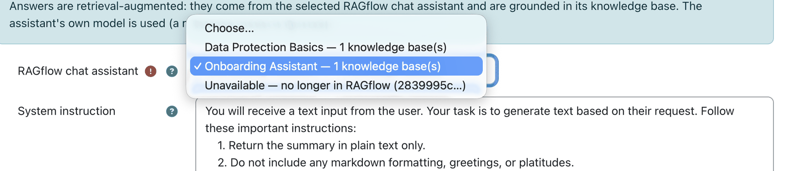
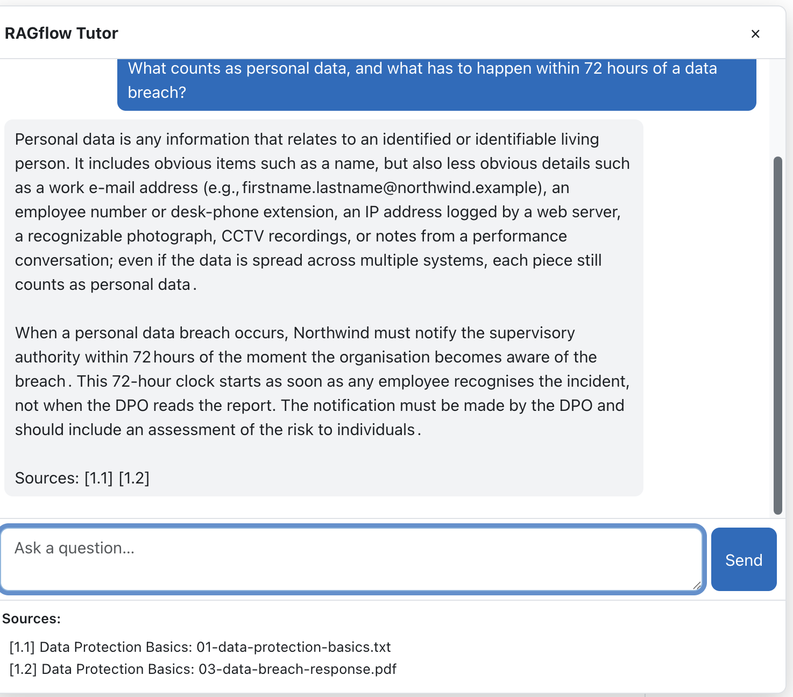
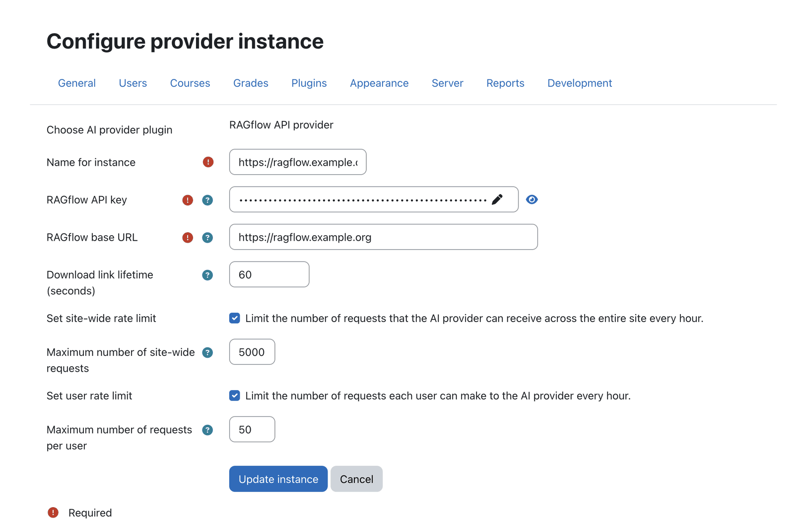
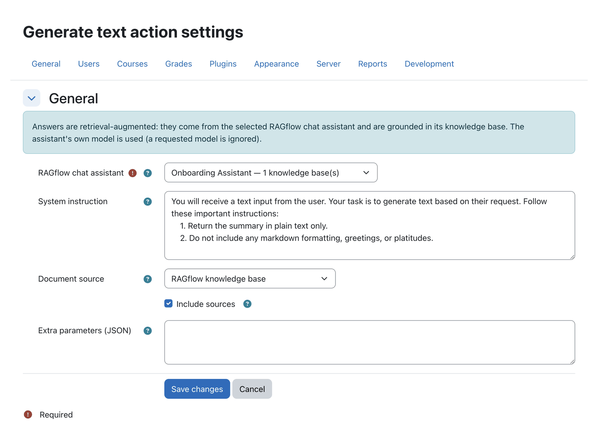

  

  

    <h1>RAGflow AI Provider</h1>
    
One backend. Grounded AI across Moodle.

  

!!! info "Repository &amp; issue tracker"
    - **Repository:** [https://github.com/ragcon-ai/moodle-aiprovider_ragflow](https://github.com/ragcon-ai/moodle-aiprovider_ragflow){ target="_blank" rel="noopener" }
    - **Issues / bug tracker:** [https://github.com/ragcon-ai/moodle-aiprovider_ragflow/issues](https://github.com/ragcon-ai/moodle-aiprovider_ragflow/issues){ target="_blank" rel="noopener" }

**Component:** `aiprovider_ragflow` 
**Requires:** Moodle 5.0–5.2 
**RAGflow:** 0.25 or later 
**Depends on:** — (root of the suite)

!!! tip "Deep document understanding"
    Answers and sources draw on the **content** of your documents — scanned pages, images and tables
    included, read by OCR, layout and vision models. See
    [Document understanding](../document-understanding.md).

The RAGflow AI provider plugs into Moodle's core **AI subsystem** and connects Moodle's text AI
actions to an external [RAGflow](https://ragflow.io) instance. Answers are produced by a RAGflow
**chat assistant** over the OpenAI-compatible endpoint, so they are retrieval-augmented and based on
the assistant's knowledge base rather than a plain LLM. It is also the shared backend of the whole
suite: it runs the chat engine, session and long-term memory, source citations and a secure download
proxy that the Tutor, Search and Helpdesk plugins use. **Install and configure it first.**

!!! abstract "At a glance"
    1. Install and enable the provider
    2. Add a provider instance
    3. Set the base URL and API key
    4. Configure the actions you want

## Features

<!-- shot:provider-02 -->

*The assistant dropdown is fetched live and shows each assistant's document count.*

<!-- shot:provider-04 -->

*Citations come from the model's own [ID] markers and are numbered per answer.*

- **Core AI actions:** serves `generate_text`, `summarise_text`, `explain_text`, each answered by the
  configured RAGflow assistant.
- **Assistant-driven model:** the assistant's own model and knowledge base are used; a live dropdown
  lists your RAGflow assistants and labels each with its knowledge-base document count (or "no
  knowledge base — LLM proxy only"), so you can pick a RAG assistant or use RAGflow as a plain LLM.
- **Knowledge-base scoping & metadata filtering:** answers can be filtered to *this Moodle* (course +
  site), the *whole KB*, or *external/shared* documents, and restricted to the current course or the
  user's enrolled courses via a document metadata field.
- **Source citations:** optionally returns the source documents behind an answer, built **from the
  model's own `[ID]` citations** (only the documents actually used). They are numbered per answer as
  `[answer.source]` (e.g. `[1.1]`, `[2.1]`), shown on a `Sources:` line at the end of the answer and as a
  linked list — linking to the Moodle activity when known, otherwise through a secure proxy.
- **Secure download proxy (`download.php`):** streams a RAGflow document from the server, so the API
  key never reaches the browser. Links are **signed and time-limited**, created when you click, and only
  safe file types open in the browser (`nosniff`; anything but PDF, PNG, JPEG, GIF, WebP or plain text
  downloads as a file).
- **Conversation (session) memory:** for the Helpdesk drawer, RAGflow keeps the conversation so
  follow-ups have context and the transcript is restored on return.
- **Long-term memory:** optional per-user durable facts via RAGflow's native Memory API (opt-in, off
  by default; disabled in private/incognito mode; cleared with the user's data).
- **Answers in the user's Moodle language** (profile or course-forced language).
- **Per-user rate limiting** (20 requests/minute) and **reliable requests** (120 s timeout,
  one retry on a network or 5xx error, not on 4xx).
- **Clear failures:** the real technical cause (HTTP status, RAGflow `{code, message}`, embedding or
  context-window errors) is shown to permitted users and to the [dashboard](dashboard.md); a coarse
  error type is recorded for usage analytics.
- **Usage events (metrics only, no content):** `chat_completed` / `chat_failed` / `search_performed`
  for the optional [dashboard](dashboard.md).
- **Scheduled task:** *Prune stale RAGflow conversation sessions* (daily) removes sessions unused past
  the retention period (default 30 days).

## Use cases

Three ways an institution runs the provider as its shared AI foundation — expand an example. Pair it with
the [RAGflow Moodle Connector](../../ragflow-moodle-connector/index.md), which feeds the courses' Moodle
content into the RAGflow knowledge bases the provider serves and keeps them current automatically.

??? example "Enterprise — one governed AI backend"
    A company configures a single provider instance for the whole site: one base URL and API key to rotate,
    in one place, and the Tutor, Search and Helpdesk all run through it.

    Per-action scoping keeps one
    department's documents from surfacing in another's answers, and the download proxy streams source files
    server-side so the API key never reaches the browser. IT sets it up once and governs it centrally.

??? example "Universities — standards-based, faculty-wide"
    A university connects Moodle's native AI subsystem to a single RAGflow instance (self-run or hosted by RAGcon), and every faculty's blocks
    and placements consume the same backend — answering in each user's Moodle language.

    Because it sits on
    the core AI subsystem rather than beside it, administrators get the same enable/disable and logging
    surface as any other AI provider, and the integration stays aligned with Moodle's roadmap.

??? example "Public sector — data sovereignty &amp; model choice"
    An authority points the provider at an on-premises RAGflow running local or EU-hosted models, so no
    learner or citizen data — and no source document — leaves its own infrastructure.

    Every answer carries a
    citation for traceability, and the whole AI setup lives in one auditable configuration.

## Configuration

The provider is configured as an **AI-provider instance** (Moodle's AI subsystem), plus per-action
config. There is no classic settings page.

### Provider instance — *Site administration → AI → AI providers → RAGflow API provider*

<!-- shot:provider-01 -->

*The provider instance holds the API key, base URL and download-link lifetime.*

| Setting | Type | Default | Meaning |
|---|---|---|---|
| **RAGflow API key** (`apikey`) | password (required) | — | Your RAGflow API key (RAGflow → *User settings → API*). Sent as the Bearer token and used to list assistants. |
| **RAGflow base URL** (`baseurl`) | URL (required) | — | Base URL of your RAGflow instance, e.g. `https://ragflow.example.com`. |
| **Download link lifetime (seconds)** (`tokenttl`) | integer | `60` (min 15) | How long a signed source/file download link stays valid. Links are minted on click, so a short lifetime is safe. |

The provider counts as *configured* only when both API key and base URL are set.

### Per-action config — *per Generate / Summarise / Explain text action*

<!-- shot:provider-03 -->

*Per-action configuration: assistant, system instruction, document source and scope.*

| Setting | Type | Default | Meaning |
|---|---|---|---|
| **RAGflow chat assistant** (`chatid`) | select (live) / text (required) | — | The assistant to answer with. Its model and knowledge base(s) are used. Pick a KB assistant for RAG, or a KB-less one to use RAGflow as a plain LLM. |
| **System instruction** (`systeminstruction`) | textarea | action default | Instructions prepended as a system message to steer the response. |
| **Document source** (`datasource`) | select | `thismoodle` | `wholekb` — *RAGflow knowledge base* (no filter); `thismoodle` — *This Moodle via Moodle Connector* (filter: course + site); or `external` — *External Moodle via Moodle Connector* (shared documents only). The two *Moodle Connector* sources require RAGflow's built-in Moodle connector to have written that metadata. |
| **Restrict to course(s)** (`coursescope`) | select | off | `Current course` or `The user's enrolled courses`. Hidden for *whole KB* / *external*. |
| **Course metadata field** (`coursemetadatafield`) | text | `course_id` | RAGflow document metadata field holding the Moodle course id. |
| **Include sources** (`includesources`) | checkbox | off | Return source documents and append them as a linked list. |
| **Extra parameters (JSON)** (`modelextraparams`) | textarea | empty | Optional JSON merged into the request body (e.g. `{"extra_body": {"reference": true}}`). Validated as JSON. |

!!! note "Where the chat/drawer settings live"
    The Tutor block and Helpdesk placement each carry their **own** copy of the chat settings
    (assistant, greeting, memory, sources, …) — configured on those plugins, not here — while the
    provider hosts the shared engine that reads them. See the [Tutor](tutor.md) and
    [Helpdesk](helpdesk.md) pages.

## Capabilities

| Capability | Default roles | Purpose |
|---|---|---|
| `aiprovider/ragflow:viewerrordetails` | Manager, Editing teacher (site admins always) | See the **technical cause** of a failed chat (a *Details* disclosure). The cause can reveal server-side internals (e.g. a RAGflow embedding error or `HTTP 502`), so it is withheld from ordinary users — enforced server-side, `RISK_CONFIG`. |

## Roles & permissions (who can do what)

The provider has **no interface of its own**. It is the backend for the Tutor, Helpdesk and Search
plugins, each of which enforces its own permissions. Only two things are governed here: **who configures
the connection** and **who sees the technical cause of a failed request**.

| Role | What this role can do |
|---|---|
| **Site administrator** | Full control: create / configure the RAGflow provider instance (URL, API key, models, rate limits) under *Site administration → AI → AI providers*, enable it for the AI actions, and see the *Details* cause of a failed chat everywhere. |
| **Manager** | Sees the **technical *Details*** of a failed chat (`:viewerrordetails`). Does **not** configure the provider (that is a site-admin area) unless separately granted `moodle/site:config`. |
| **Teacher (editing)** | Sees the *Details* of a failed chat **in their course**. |
| **Non-editing teacher · Student · any authenticated user** | Use the AI features built on the provider, following each plugin's own rules. On a failure they see only a **generic message**; the technical cause is not shown. |
| **Guest / not logged in** | No access. |

## Privacy

By default the plugin stores **no personal data** in Moodle. Prompts (and, with long-term memory on,
the ongoing conversation and remembered facts) are **sent to and stored in RAGflow** (a third-party
processor). A small local table references RAGflow **conversation sessions** for the Helpdesk memory.
On user deletion, the plugin deletes those sessions and **forgets** the user's RAGflow memory. Users
can self-disable long-term memory via **private/incognito mode** in the chat; that choice is stored as
a per-user Moodle preference (`aiprovider_ragflow_privatemode`) and is exported and deleted with the
user's data.

See also: [Moodle version specifics](../moodle-version-notes.md) for `public/` layout and
version-guarded error handling.
