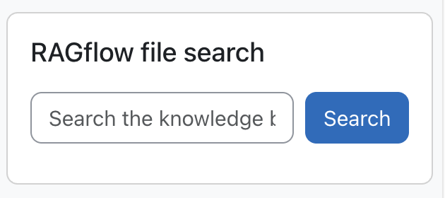
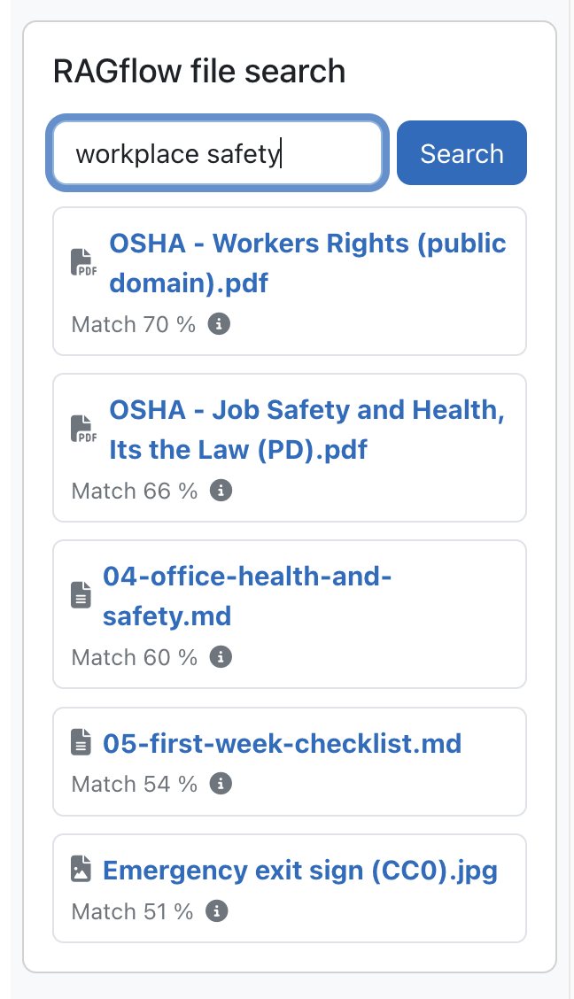
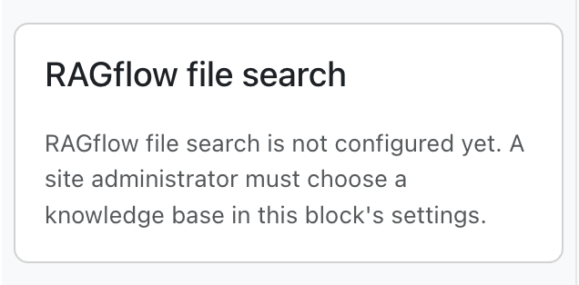
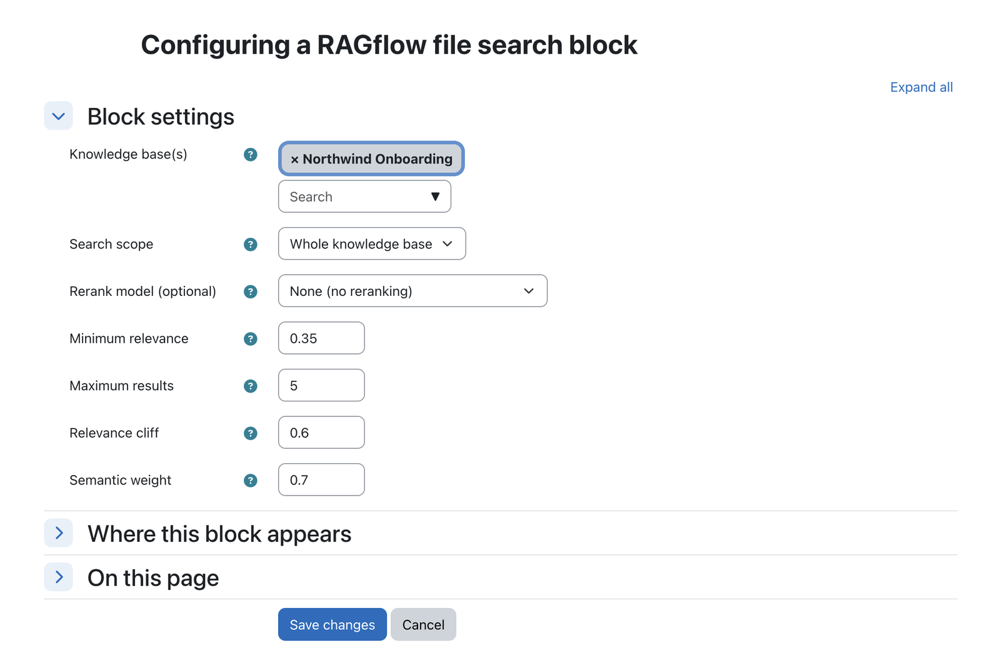
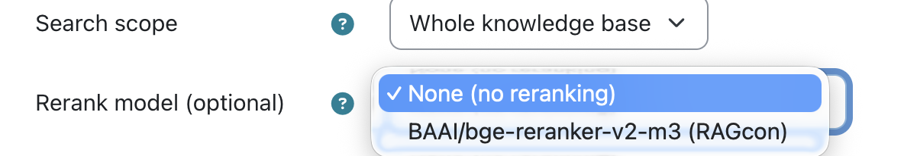

  

  

    <h1>RAGflow Search</h1>
    
Find documents by meaning, not keywords.

  

!!! info "Repository &amp; issue tracker"
    - **Repository:** [https://github.com/ragcon-ai/moodle-block_ragflowsearch](https://github.com/ragcon-ai/moodle-block_ragflowsearch){ target="_blank" rel="noopener" }
    - **Issues / bug tracker:** [https://github.com/ragcon-ai/moodle-block_ragflowsearch/issues](https://github.com/ragcon-ai/moodle-block_ragflowsearch/issues){ target="_blank" rel="noopener" }

**Component:** `block_ragflowsearch` 
**Display name:** *RAGflow file search* 
**Requires:** Moodle 5.0–5.2 
**Depends on:** `aiprovider_ragflow`

!!! tip "More than a keyword search"
    This block searches the **content** of your files — including scanned PDFs, images and tables — by
    meaning, not just their titles. See [Document understanding](../document-understanding.md).

A Moodle block that adds a search box to any page and searches one or more RAGflow **knowledge bases**
semantically and lists the matching source documents. It is **retrieval only: no answer is generated by
an LLM**, so results cannot be invented and always link to real documents. The basic search is fast and
cheap; an **optional rerank model** re-orders the results for better precision, at a little extra latency.
The search itself runs in the shared [AI provider](provider.md), and each block chooses its knowledge
base and scope.

<!-- shot:search-01 -->

*The Search block adds a semantic search box to any page.*

## Features

<!-- shot:search-02 -->

*Results carry a relevance score and a snippet and link to the source document.*

<!-- shot:search-06 -->

*Users who may configure the block see a hint instead of a dead search box.*

- **Placeable on any page** (courses, the Dashboard, the front page, …).
- **Semantic search over one or more RAGflow datasets**, chosen per block instance.
- **One ranked list of matches** (documents and media together, ordered by match score). Each row shows a
  **file-type icon**, the file name and the **match score**; the matching text excerpt appears **on hover**
  (info icon). Each result links to the source document through the provider's secure download proxy (the
  RAGflow API key never reaches the browser).
- **Quality filters for better matches:** a relevance floor, a relevance cliff and a result cap
  remove weak hits; **images and media** keep a lower floor so they are not lost; a **semantic weight**
  helps full-sentence questions match by meaning; and an **optional rerank model** improves precision
  further (see [Result quality](#result-quality-fewer-better-matches)).
- **Scope: whole KB or current course** (course scope filters by a configurable metadata field; on
  pages without a course the whole KB is searched).
- **Login-gated** (no content for logged-out users or guests); **one instance per page**.
- **Helpful empty states:** a *not configured* hint for users who can add the block, a
  *no knowledge bases available* message if the provider isn't enabled, and a *knowledge base was deleted
  in RAGflow* notice when a search returns nothing because a configured dataset no longer exists
  (privileged users additionally see which dataset).

## Use cases

Three ways teams use the Search block — expand an example. Pair any of them with the
[RAGflow Moodle Connector](../../ragflow-moodle-connector/index.md) to keep the searchable knowledge base
in step with the documents maintained in Moodle, with no manual re-upload.

??? example "Enterprise — find the right document fast"
    A company keeps policies, product docs and process guides in Moodle, and staff waste time hunting for
    the right file.

    The Search block finds it by meaning — a query like *"parental leave"* surfaces the
    actual policy PDF and the passage that matched, as a link, with no generated answer to second-guess.
    Scanned forms and posters stay findable because RAGflow reads their content (OCR and a vision model),
    not just their filename.

??? example "Universities — course library &amp; past papers"
    Students search across course handouts, lab manuals and past exam papers by meaning rather than exact
    title — useful when the file they need is a scanned handout or an oddly named PDF.

    Every result links
    straight to the source document, so a student verifies the original instead of trusting a summary.

??? example "Public sector — auditable information retrieval"
    A public body offers a knowledge base of regulations, forms and procedures. Retrieval-only search
    returns the authoritative document itself — no LLM step, nothing that can hallucinate — which is
    exactly the property a compliance or citizen-information context needs.

    It runs self-hosted, so the
    corpus stays under the body's control.

## Configuration

Almost all configuration is **per block instance**, and only **site administrators** may set it
(non-admins see an "only site administrators can choose the knowledge base" message, and their saves
cannot clear the choice). The only **site-wide** setting is an optional logging toggle (below).

### Per-instance block config (*Configure this RAGflow file search block*)

<!-- shot:search-04 -->

*All settings are per block instance: datasets, scope, rerank model and thresholds.*

| Setting | Type | Default | Meaning |
|---|---|---|---|
| **Knowledge base(s)** (`config_datasets`) | autocomplete (multiple) | none (required) | The RAGflow dataset(s) this block searches. Select one or more; the block does not search until at least one is chosen. |
| **Search scope** (`config_scope`) | select | `Whole knowledge base` | *Whole knowledge base* or *Current course only* (matched via the course metadata field). On pages without a course, the whole KB is searched. |
| **Course metadata field** (`config_coursefield`) | text | `course_id` | RAGflow document metadata field holding the Moodle course id. Only used when scope is *Current course only*. |
| **Rerank model** (`config_rerankmodel`) | select | None (off) | *Optional.* A **dropdown of the rerank models available in your RAGflow** (fetched live; a hint is shown if none is configured). When set, RAGflow reorders the candidates with a cross-encoder for markedly better precision. Choose *None* for plain vector/keyword ranking. |
| **Semantic weight** (`config_vectorweight`) | number | `0.7` | Balances **meaning-based (vector)** vs. **literal keyword** matching (0–1). Higher = questions asked in full-sentence form match by meaning; lower = literal keyword matching dominates. RAGflow's own default (0.3) is keyword-heavy and scores sentence questions poorly. |
| **Minimum relevance** (`config_minsimilarity`) | number | `0.35` | Text results below this score (0–1) are dropped. Higher = fewer/stricter, lower = more/looser. Images/media keep their own, lower floor. |
| **Maximum results** (`config_maxresults`) | number | `5` | Upper bound on the number of text (non-media) results kept. Images/media are kept under their own lower relevance floor (up to 3 more) and shown inline in the single match-ranked list. |
| **Relevance cliff** (`config_cliffratio`) | number | `0.6` | Keep a result only while its score stays within this fraction (0–1) of the top hit. Lower = keep more mid-ranked results; `0` = off. |

### Site-wide setting — *Site administration → Plugins → Blocks → RAGflow file search*

| Setting | Type | Default | Meaning |
|---|---|---|---|
| **Write log data** (`logtomoodle`) | checkbox | off | Write a concise usage/error entry (metrics only) to the Moodle standard log per search; independent of the RAGflow [dashboard](dashboard.md). |

## Result quality (fewer, better matches)

<!-- shot:search-05 -->

*The rerank dropdown lists the rerank models available in your RAGflow.*

The search is tuned to return a **short, relevant list** instead of a fixed number of hits. The defaults
work well; the **semantic weight**, **minimum relevance**, **maximum results** and **relevance cliff** can
be tuned per block (see the config table above), and reranking is opt-in.

- **Relevance floor:** matches below a minimum score are dropped, so weakly related documents no longer
  clutter the list.
- **Relevance cliff + result cap:** once the scores fall away from the best hit (or the cap of 5 is
  reached), the list stops. A query with two strong matches returns two, not a padded eight.
- **Semantic weight (sentence questions):** the hybrid search blends meaning-based (vector) and keyword
  scoring. A higher **semantic weight** (default `0.7`) lets meaning dominate, so a question asked as a full
  sentence matches the right document instead of only its literal keywords. RAGflow's own default is
  keyword-heavy, which scores sentence questions poorly; raising the weight is the main fix.
- **Images and media appear in the same list:** images and other media embed with **low text similarity**,
  so a single floor would wrongly hide them. They keep a **lower floor** so they still appear; all results
  (documents and media) then appear in **one list ordered by match score**, so media sit with their
  (lower) scores rather than being dropped or diluting the ranking.
- **Optional reranking:** set a **rerank model** (above) and RAGflow reorders the retrieved candidates
  with a cross-encoder. This is the single biggest precision gain: the truly relevant documents rise to
  the top and the weaker ones fall below the cliff. It is opt-in (needs a rerank model in your RAGflow)
  and adds a little latency.

**In short:** shorter, more trustworthy result lists; no irrelevant filler; images stay findable; and,
with reranking on, noticeably sharper ordering. Sensible defaults apply from the start.

## Capabilities

| Capability | Default roles | Purpose |
|---|---|---|
| `block/ragflowsearch:addinstance` | Teacher, Manager | Add a search block to a page |
| `block/ragflowsearch:myaddinstance` | Authenticated user | Add the block to the Dashboard / My home |

!!! note
    Choosing the knowledge base and scope is restricted to **site administrators** (not a capability),
    because a dataset is a site-wide resource.

## Roles & permissions (who can do what)

The search block has **no dedicated "use" capability**: anyone who can **see** the block can search it
and open results. Permissions only govern **who may add the block** and **who sets up its knowledge base**.

| Role | What this role can do |
|---|---|
| **Site administrator** | Add the block anywhere **and** choose its **knowledge base and scope** (a site-wide dataset resource, admin-only, not a capability). Also sets the site-wide block setting. |
| **Manager · Teacher (editing)** | **Add** a search block to a course page (`:addinstance`) and set its display options; **cannot** choose the knowledge base / scope (site-admin only). |
| **Any authenticated user** | Add the block to their **own Dashboard / My home** (`:myaddinstance`). |
| **Non-editing teacher · Student · anyone who can view the block** | **Search** and open results; no extra permission is needed beyond seeing the block. |
| **Guest / not logged in** | Can search only where guest viewing of the page is allowed; otherwise no access. |

## Privacy

The block **stores no personal data**. Search queries are sent to the configured RAGflow service by
the [AI provider](provider.md) to retrieve matching documents; source links go through the provider's
secure proxy.
