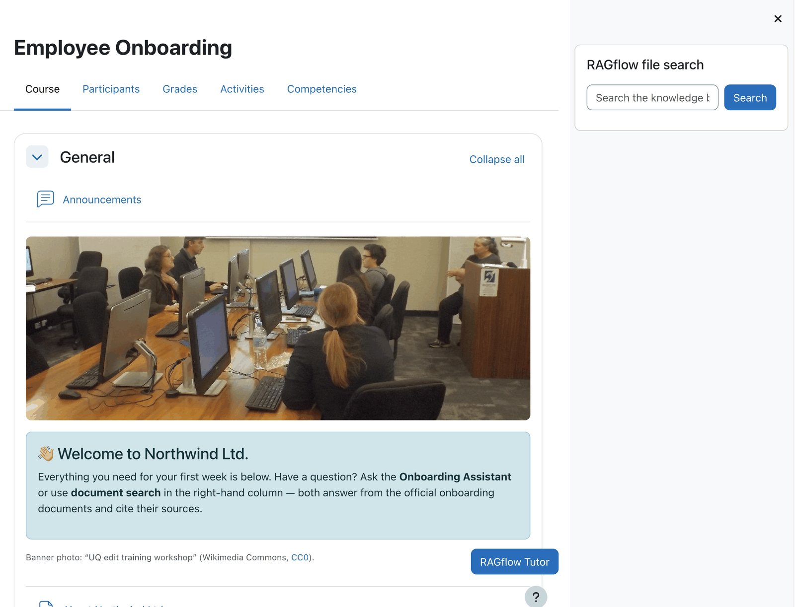
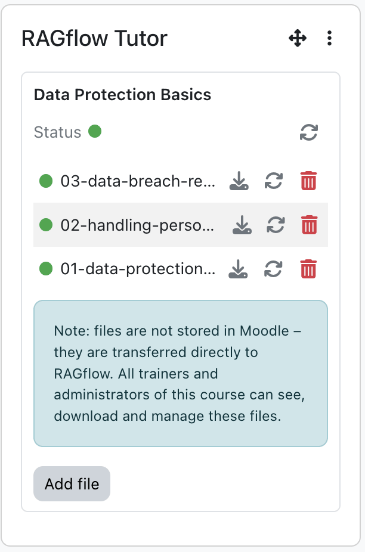
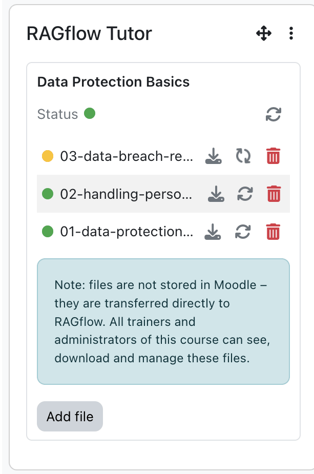
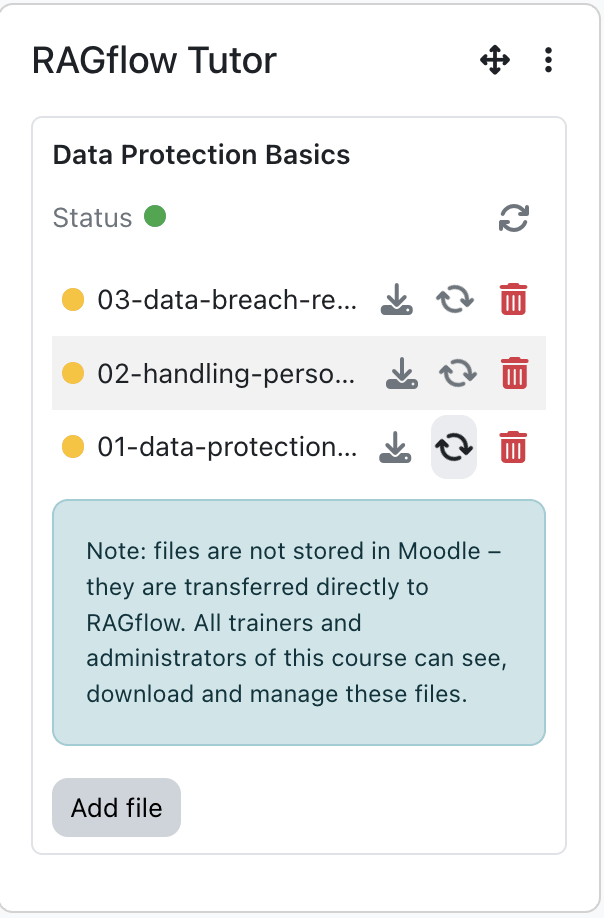
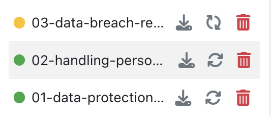
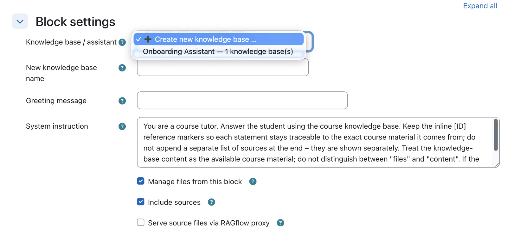
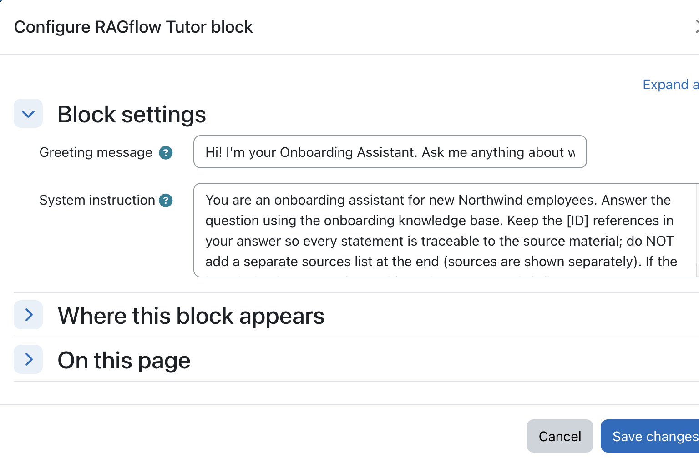
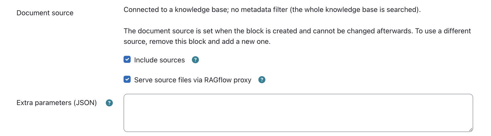
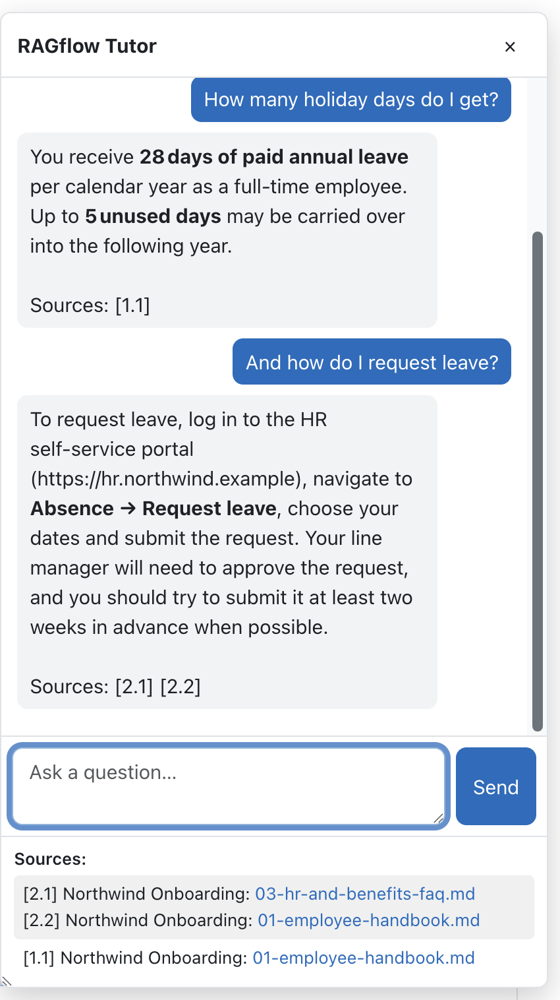

# Tutor block

!!! info "Repository &amp; issue tracker"
    - **Repository:** [https://github.com/ragcon-ai/moodle-block_ragflowtutor](https://github.com/ragcon-ai/moodle-block_ragflowtutor){ target="_blank" rel="noopener" }
    - **Issues / bug tracker:** [https://github.com/ragcon-ai/moodle-block_ragflowtutor/issues](https://github.com/ragcon-ai/moodle-block_ragflowtutor/issues){ target="_blank" rel="noopener" }

**Component:** `block_ragflowtutor` 
**Requires:** Moodle 5.0–5.2 
**Depends on:** `aiprovider_ragflow`

!!! tip "Deep document understanding"
    Answers draw on the **content** of your documents — scanned pages, images and tables included, read
    by OCR, layout and vision models. See [Document understanding](../document-understanding.md).

A per-course **AI tutor** delivered as a Moodle block. Placed on a course or activity page, it renders
a chat drawer that answers students' questions using a RAGflow knowledge base for that course. Each
block instance has its **own knowledge base**: teachers upload course documents and manage them
directly in the block. The chat engine, credentials and knowledge-base API come from the shared
[AI provider](provider.md).

<!-- shot:tutor-01 -->

*The Tutor block sits on the course page and opens a chat drawer.*

## Features

<!-- shot:tutor-02 -->

*The drawer opens with the greeting configured for the course.*

<!-- shot:tutor-07 -->

*The knowledge-base panel: green means ready, with the file list below.*

<!-- shot:tutor-08 -->

*Yellow while the knowledge base is linking or files are still parsing.*

<!-- shot:tutor-09 -->

*Teachers can re-process a document without re-uploading it.*

<!-- shot:tutor-10 -->

*Per file: re-process, download through a signed link, or delete.*

- **Course tutor chat drawer** for anyone with the *use* capability. The transcript is kept in the
  browser, with a per-user rate limit in the shared engine.
- **Greeting & system instruction** per block, to set the tone and behaviour for the course.
- **Per-instance knowledge base / assistant:** pick an existing RAGflow assistant (labelled with its
  document count) **or create a new knowledge base inline**. The block creates the RAGflow dataset and
  assistant, adds a small `README.md`, links them, and (for larger uploads) finishes linking in the
  background.
- **In-block knowledge-base panel** (for managers and trainers with *manage files*): a status line with
  a colour-coded status light (green ready / yellow linking or parsing / red error), a refresh button, the
  file list and an upload area. It refreshes automatically while the knowledge base is linking or files are
  still parsing.
- **File management** (only when the block manages the files — a new KB with *Manage files from this block*):
    - **Upload** multiple files (streamed as multipart, so large files are fine); each is virus-scanned
      (Moodle antivirus), size-checked, pushed into the knowledge base and parsed.
    - **Re-process** a file, **delete** a file (with confirmation), or **download** a file through a
      short-lived signed link that is created when you click.
    - An internal `README.md` is always hidden and can never be downloaded, deleted or re-parsed, and
      every action can only touch this block's own knowledge base.
- **Answers in the user's Moodle language**; optional **source citations**.

!!! warning "Uploaded documents live in RAGflow, not Moodle"
    Files uploaded through the Tutor block are transferred directly to RAGflow and are visible/
    manageable by all trainers and admins of the course. They are not stored in Moodle.

## Configuration

### Admin setting — *Site administration → Plugins → Blocks → RAGflow Tutor*

| Setting | Type | Default | Meaning |
|---|---|---|---|
| **Upload limit for Moodle knowledge bases** (`uploadlimit`) | select | `50` MB | Max size per document uploaded to a Moodle-managed KB (50 MB / 500 MB / Unlimited). The effective ceiling is the smaller of this and Moodle's own max upload size. |
| **Write log data** (`logtomoodle`) | checkbox | off | Write a concise usage/error entry (metrics only, no message content) to the Moodle standard log per request; independent of the RAGflow [dashboard](dashboard.md). |

### Per-instance block config (*Configure this RAGflow Tutor block*)

Fields are shown according to the editor's capabilities (site admins see all).

**Knowledge base / assistant** *(admin, change-KB or create-KB)*

<!-- shot:tutor-04 -->

*Pick an existing assistant or create a brand-new knowledge base inline.*

| Field | Type | Default | Meaning |
|---|---|---|---|
| **Knowledge base / assistant** (`config_chatid`) | select | — | The RAGflow assistant this Tutor uses. Users with *create KB* also get "➕ Create new knowledge base …". |
| **New knowledge base name** (`config_newkbname`) | text | — | Shown only when creating a new KB; must be unique. |

**Content** *(admin or edit-content — trainers)*

<!-- shot:tutor-05 -->

*Trainers can adjust greeting and system instruction without touching admin settings.*

| Field | Type | Default | Meaning |
|---|---|---|---|
| **Greeting message** (`config_greeting`) | text | course-tutor default | First message shown when the chat opens. |
| **System instruction** (`config_systeminstruction`) | textarea | built-in default prompt | Instruction prepended to each request. |

**Document source & citations** *(site admin only; labels from the provider)*

<!-- shot:tutor-06 -->

*The document source is fixed when the block is created; citation options stay editable — site admins only.*

| Field | Type | Default | Meaning |
|---|---|---|---|
| **Manage files from this block** (`config_managefiles`) | checkbox | on | *Shown only when creating a **new** knowledge base.* On (default) the block owns the knowledge base and you upload/manage its documents from the in-block panel. Off connects Moodle to the new knowledge base only — you then add and manage its documents in **RAGflow** itself (no in-block file panel). |
| **Metadata filtering** (`config_metadatafilter`) | select | `No` | *Shown only when connecting to an **existing** knowledge base.* `No` (whole KB, no filter), `Moodle Connector` (restrict to the current course by `course_id` + site URL; on the site home, where there is no course, no filter is applied), or `External sharing` (only documents with `external_sharing = 1`). The two connector options require RAGflow's built-in Moodle connector to have written that metadata; without it the tutor answers "nothing found". |
| **Course metadata field** (`config_coursemetadatafield`) | text | `course_id` | Metadata field used to filter (only for the *Moodle Connector* option). |
| **Include sources** (`config_includesources`) | checkbox | off | Show source links with answers. |
| **Serve source files via RAGflow proxy** (`config_serveviaproxy`) | checkbox | off | Stream sources through the secure proxy (hidden unless *Include sources* is on). |
| **Extra parameters (JSON)** (`config_extraparams`) | textarea | — | Extra JSON merged into the request. |

!!! info "Document source is fixed after creation"
    The document source is structural (it decides the metadata filter and is bound to the knowledge base
    chosen at creation). It is chosen **once**, via *Manage files from this block* (new KB) or *Metadata
    filtering* (existing KB); after the block is bound to a knowledge base the choice is shown **read-only**
    with a short summary. To change it, remove the block and add a new one.

!!! tip "Trainers can't overwrite admin settings"
    On save, only the fields the current user may change are written, so a trainer editing the greeting
    cannot clear the admin-only knowledge-base / source settings.

## Sources & citations

<!-- shot:tutor-03 -->

*Each answer ends with a Sources line; the Sources panel lists the matching files.*

When **Include sources** is on, the Tutor lists the documents behind each answer **from the model's own
citations** — i.e. only the documents the answer actually used, not a separate, blind similarity search.
This avoids weakly-related documents showing up as "sources".

- Each answer ends with a short **`Sources:` line** (e.g. `Sources: [1.1]`) and the drawer's **Sources
  panel** lists the matching files, each prefixed with the same reference.
- References are numbered **per answer** as `[answer.source]`: the first answer's sources are `[1.1]`,
  `[1.2]`, …, the second answer's are `[2.1]`, `[2.2]`, and so on — so it stays clear which files belong
  to which answer as the conversation (and the stacked Sources panel) grows.
- A cited document is always listed, even if it is an **image or other low-text-similarity file**: the
  model's citation is the relevance signal.
- If the model cites nothing (including a **"nothing relevant found"** answer), the Sources panel stays
  **empty**. A not-found answer never shows a source.

!!! note "Keep the `[ID]` markers in a custom system instruction"
    The citation list depends on the model emitting its `[ID]` reference markers. The default **System
    instruction** asks the model to keep them; if you customise it per course, do **not** tell the model
    to omit `[ID]` references, or answers will show no sources at all.

## Capabilities

| Capability | Default roles | Purpose |
|---|---|---|
| `block/ragflowtutor:use` | Student, Teacher, Manager | Ask questions in the tutor |
| `block/ragflowtutor:addinstance` | Teacher, Manager | Add the block to a course |
| `block/ragflowtutor:editcontent` | Teacher, Manager | Edit greeting / system instruction |
| `block/ragflowtutor:editkb` | Manager | Change the knowledge base / assistant |
| `block/ragflowtutor:createkb` | Manager | Create a new knowledge base from the block |
| `block/ragflowtutor:managefiles` | Teacher, Manager | Manage the documents of a Moodle-managed KB (and see the KB panel) |

!!! note "Who wires the knowledge base"
    Adding the block is a **teacher**-level action, but **choosing or creating** its knowledge base and
    assistant needs *change* or *create knowledge base*, which is **Manager** (or site admin) by default.
    The two roles split cleanly: a manager sets the knowledge base up once; teachers then manage its
    documents and set the greeting and system instruction. Until a manager sets one up, a teacher who
    opens the unconfigured block is asked to **contact a site administrator**, because the knowledge-base
    field is not shown to their role. Grant `:editkb` (and optionally `:createkb`) to the teacher role if
    you want trainers to set it up themselves.

## Roles & permissions (who can do what)

| Role | What this role can do |
|---|---|
| **Site administrator** | Everything below, in any course. |
| **Manager** | Add the block, chat, edit the greeting and system instruction, and manage the knowledge base's documents. It is also the only role that may **change or create** the knowledge base or assistant (`:editkb` / `:createkb`), so it sets the knowledge base up. |
| **Teacher (editing)** | **Add** the block (`:addinstance`), **chat** (`:use`), **edit** the greeting and system instruction (`:editcontent`), and **manage documents** of a Moodle-managed knowledge base: upload, delete and see the panel (`:managefiles`). **Cannot** choose or create the knowledge base itself (manager only, by default). |
| **Non-editing teacher** | **Chat** with the tutor (`:use`). No configuration. |
| **Student** | **Chat** with the tutor (`:use`). No configuration. |
| **Guest / not logged in** | No access. |

See the *"Who wires the knowledge base"* note above to let editing teachers set the knowledge base up
themselves (grant `:editkb` / `:createkb`).

## Privacy

The block **stores no personal data itself**. The conversation exists only in the browser; prompts are
handled by the [AI provider](provider.md). Uploaded documents are stored in RAGflow (see the warning
above), and a newly created knowledge base's `README.md` records where it came from (site URL, course,
block id, creator, timestamp).
