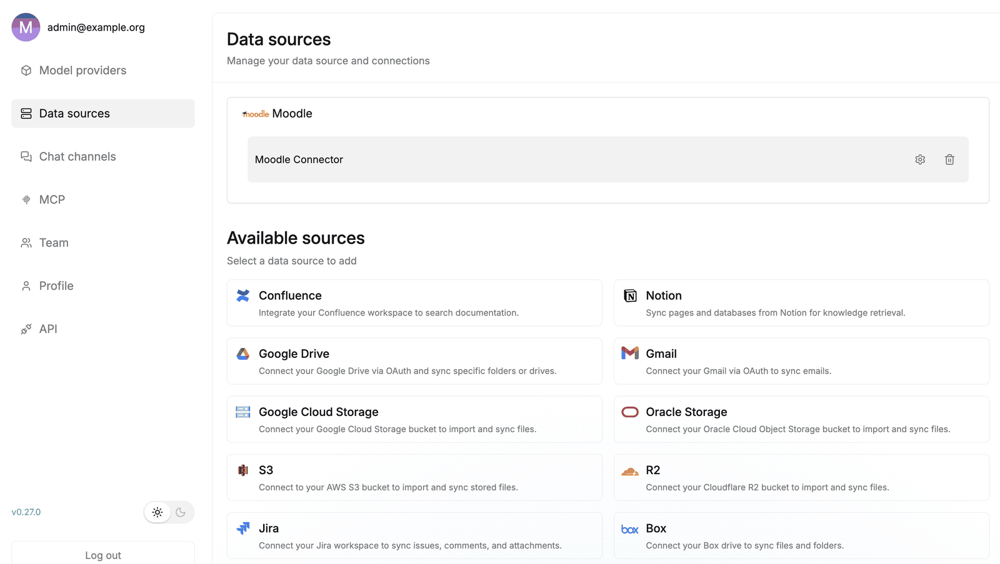

# RAGflow Moodle Connector

The **Moodle connector** is a built-in [RAGflow](https://ragflow.io/) **data source**: it syncs the
content of a Moodle site into a RAGflow **knowledge base**, so that content can be searched, cited and
answered over by any RAGflow assistant. It sits in the same family as RAGflow's Confluence, GitHub, Google
Drive and Slack connectors and is configured the same way — under *User settings → Data sources* in RAGflow.

!!! info "Part of RAGflow — built by RAGcon"
    The Moodle connector is part of the **official, open-source [RAGflow](https://github.com/infiniflow/ragflow)**
    codebase (contributed by **RAGcon GmbH**). This documentation describes how it works and how to run it;
    the connector itself ships with RAGflow.

<!-- shot:connector-01 -->

*Moodle is a built-in RAGflow data source, added under User settings → Data sources.*

## What it does

Given a Moodle site and a web-service token, the connector walks the **courses the token's user is enrolled
in**, reads each course's sections and activities, and turns the relevant ones into RAGflow documents:

- **Files** (resource activities) are downloaded and indexed as-is (PDF, DOCX, …).
- **Pages**, **Books**, **Forums** and **Assignment/Quiz descriptions** are converted to clean Markdown.
- Every document carries **rich metadata** — course, section, module, timestamps, visibility — so
  downstream tools can filter by course or site (see [Content &amp; metadata](content-and-metadata.md)).

It keeps the knowledge base in step with Moodle: an **incremental sync** picks up new and changed items,
and **removed** activities are cleaned out of the index (see [Sync behaviour](sync-behaviour.md)).

## Where it fits

RAGflow needs *content* before it can answer anything. The Moodle connector is the **supply side** — it
gets your Moodle material into a RAGflow knowledge base. What you do with that knowledge base afterwards is
separate:

| | |
|---|---|
| **RAGflow Moodle Connector** (this product) | **Puts Moodle content into** a RAGflow knowledge base — a RAGflow data source. |
| **[Moodle RAGflow Suite](../moodle-ragflow/index.md)** (separate) | **Consumes** RAGflow from inside Moodle — Tutor, Search and Helpdesk plugins that query a knowledge base and show answers/sources to users. |

The two are complementary but independent: you can use the connector to feed any RAGflow assistant, and the
Moodle plugins can query any knowledge base — including one filled by this connector. The connector's
`course_id` + `moodle_url` metadata is exactly what powers the suite's *Moodle Connector* course-scope
filter (see [Using it with the Moodle RAGflow Suite](moodle-suite.md)).

## In short

- A **RAGflow data source** for **Moodle** — no plugin to install in Moodle, just a web-service token.
- Syncs **files, pages, books, forums and assignment/quiz descriptions** from the enrolled courses.
- Writes **course/section/module metadata** on every document.
- **Incremental** sync with **stale-document cleanup**.

Next: [How it works](how-it-works.md) · [Set it up](setup.md).
