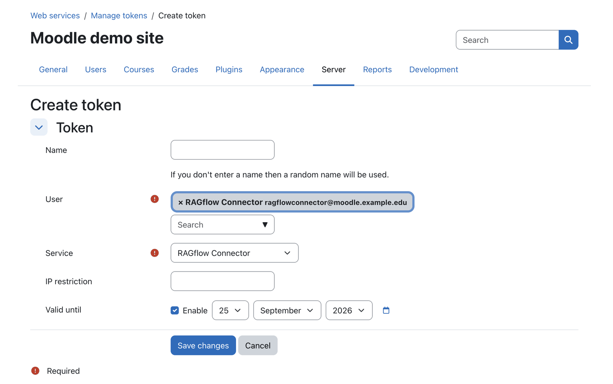
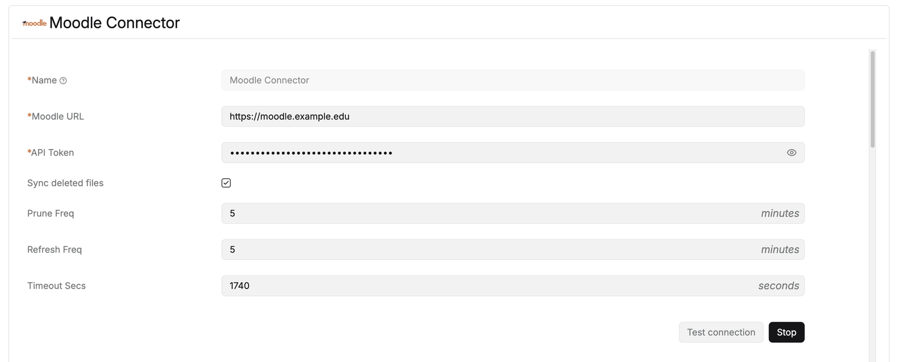

# Set up the connector

Two things are needed: a **Moodle web-service token** for the connector to read with, and a **data source**
in RAGflow that uses it.

!!! abstract "At a glance"
    1. Enable web services in Moodle
    2. Create a web-service token
    3. Add the Moodle data source in RAGflow
    4. Bind it to a knowledge base and sync

## Prerequisites

- A **Moodle** site (admin access to create a web service + token).
- A **RAGflow** instance with the Moodle connector (it ships with RAGflow).
- A **user account** in Moodle that is **enrolled in the courses you want to sync**. The connector sees
  exactly what this user sees — no more, no less.

## 1. Enable web services in Moodle

*Site administration → Advanced features* → enable **Enable web services**. Then
*Site administration → Server → Web services → Manage protocols* → enable **REST**.

## 2. The web-service token

Create a token that can read course contents and download files.

1. Define (or reuse) an **external service** that exposes the functions the connector calls:
   *Site administration → Server → Web services → External services* → add a service, then add these
   functions to it:
       - `core_webservice_get_site_info`
       - `core_course_get_courses`
       - `core_course_get_contents`
       - `mod_forum_get_forum_discussions`
2. In the service's own settings, tick **Can download files**. Reading a course's contents and
   downloading its files are two separate permissions in Moodle; without this the connector sees the
   resource activities but cannot fetch the files behind them.
3. Create the token: *Site administration → Server → Web services → Manage tokens* → **Create token** for
   the intended **user** on that **service**.

<!-- shot:connector-03 -->

*Create a web-service token in Moodle for a user enrolled in the courses to sync.*

!!! warning "The token acts as its user"
    The connector reads with this user's permissions and only sees the user's **enrolled courses**. Give it
    a dedicated account enrolled (e.g. as a non-editing teacher) in the courses to index, and the capability
    to **download course files**. Treat the token like a password — see [Security &amp;
    permissions](security.md).

!!! tip "Base URL"
    Use the site's base URL only — e.g. `https://moodle.example.edu`. **Do not** include `/webservice`,
    `/login` or a trailing path; the connector adds `/webservice/rest/server.php` itself.

## 3. Add the data source in RAGflow

In RAGflow, open *User settings → Data sources*, add a **Moodle** source and fill in:

<!-- shot:connector-02 -->

*Point the connector at your Moodle base URL, paste the web-service token and set the sync cadence.*

| Field | Value |
|---|---|
| **Name** | A label for this source, e.g. `Moodle Connector`. It appears in the sync log and on the knowledge base. |
| **Moodle URL** | The Moodle base URL (e.g. `https://moodle.example.edu`). |
| **API Token** | The web-service token from step 2. |
| **Sync deleted files** | Off by default. On, the connector also removes documents whose Moodle module has disappeared — see [Sync behaviour](sync-behaviour.md#removing-deleted-items-stale-cleanup). Ticking it reveals **Prune Freq**. |
| **Prune Freq** | Only shown when *Sync deleted files* is on: how often the stale-cleanup pass runs, in **minutes**. It is separate from the content sync, so cleanup can run at its own, usually slower, cadence. |
| **Refresh Freq** | How often the source re-syncs its content, in **minutes**. |
| **Timeout Secs** | Upper bound for a single sync run. Raise it for large sites; a run that exceeds it is cut off and retried on the next schedule. |

**Test connection** validates the token straight away (it calls `core_webservice_get_site_info`); a bad
token or missing web-service permissions are reported here — see [Troubleshooting](troubleshooting.md).

## 4. Bind it to a knowledge base and sync

Attach the data source to the **knowledge base** that should hold the Moodle content, then run the first
**sync**. The initial run is a **full load** of all enrolled courses; after that RAGflow syncs
**incrementally**; with **Sync deleted files** enabled it also removes documents for items deleted in
Moodle. See [Sync behaviour](sync-behaviour.md) for the details and scheduling.

Once the knowledge base has parsed content, any RAGflow assistant can use it — and, if you run the Moodle
plugins, so can they (see [Using it with the Moodle RAGflow Suite](moodle-suite.md)).
